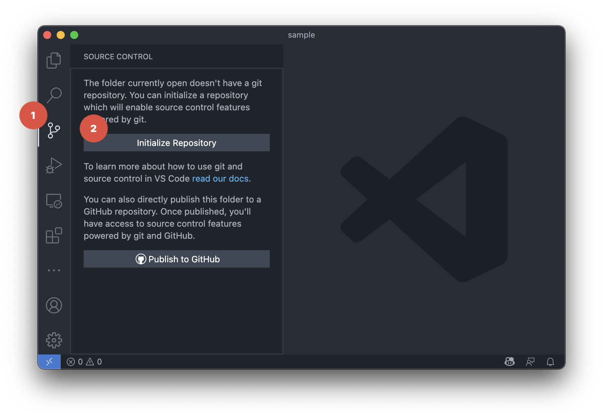
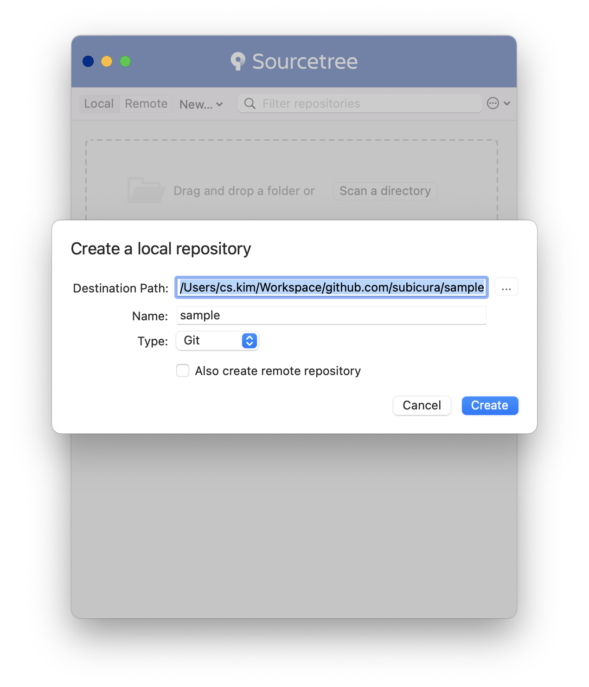
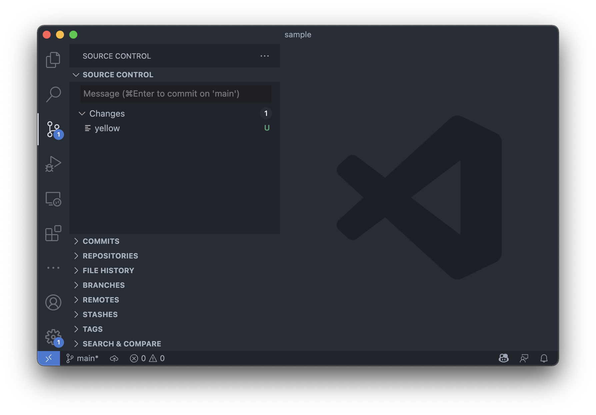
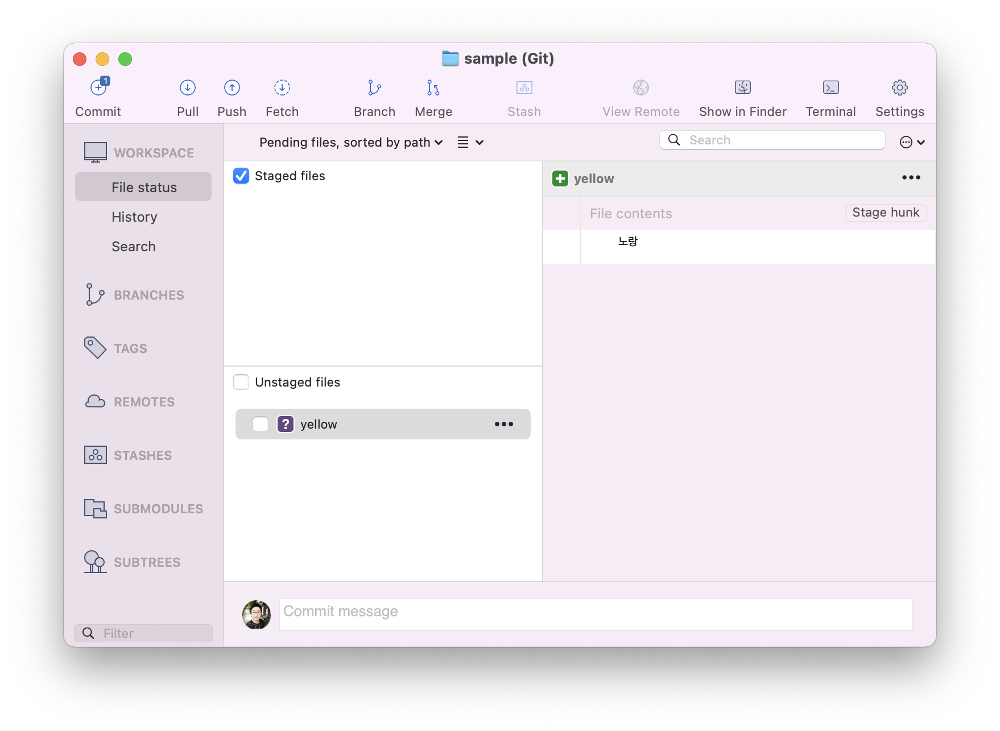
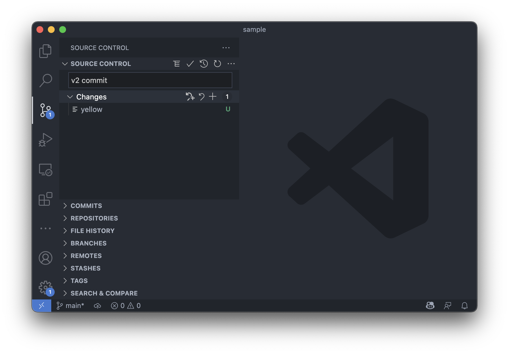
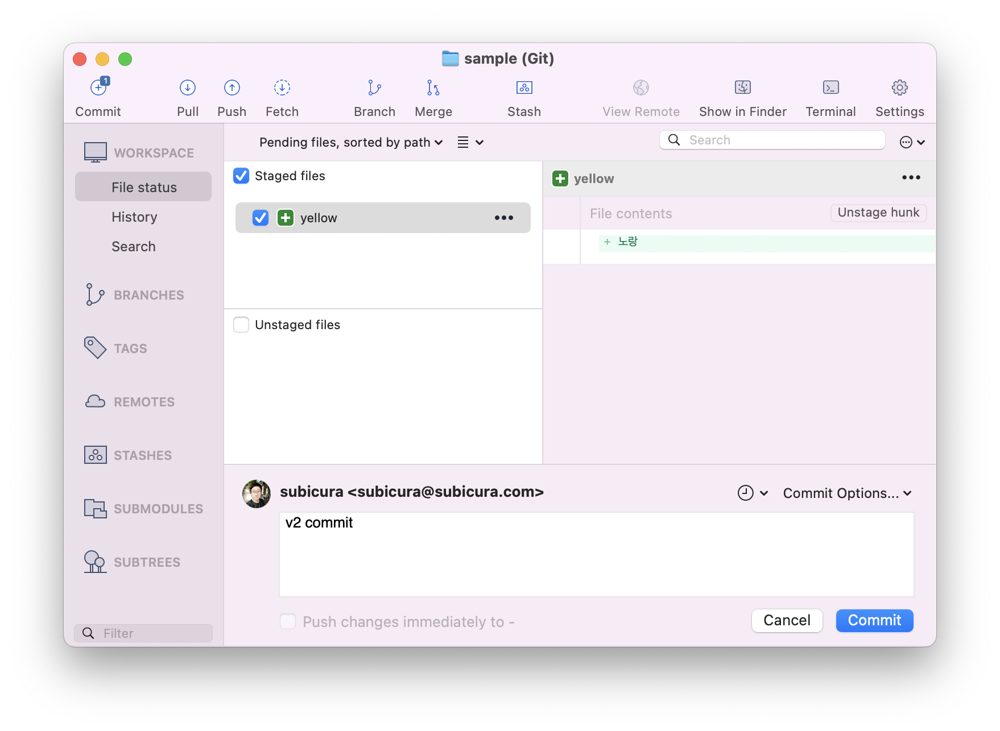
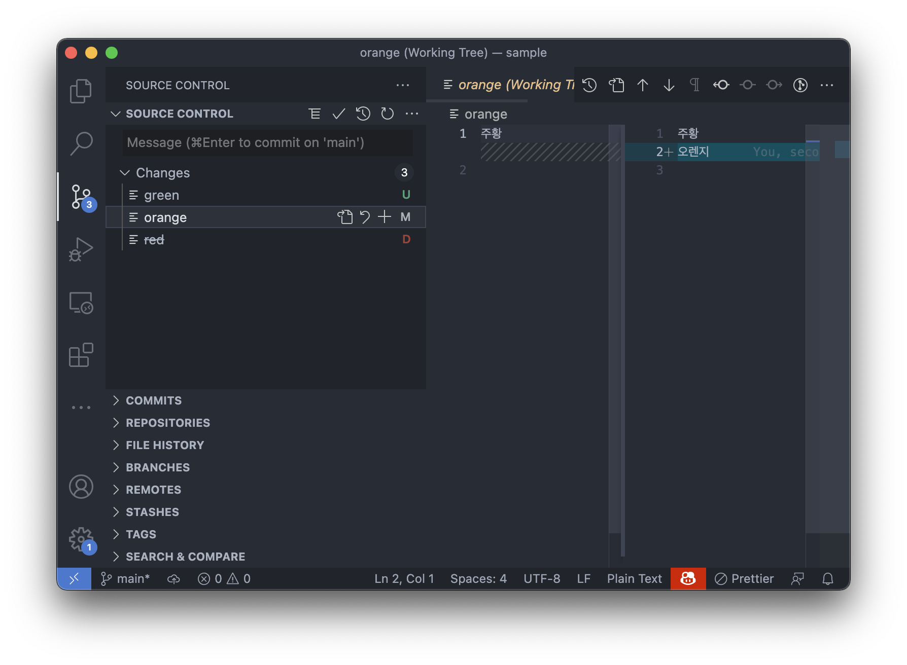
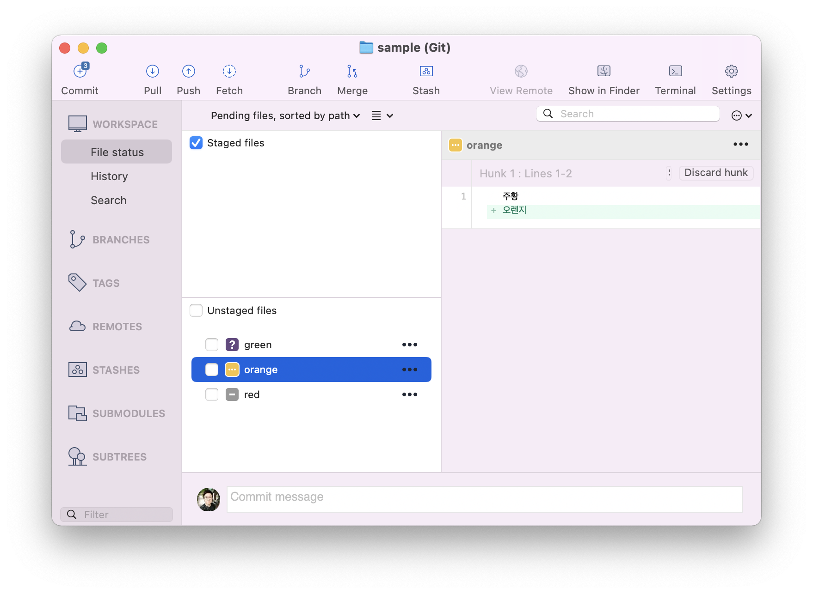

# 기본 명령어

::: tip ⚡️ 목표
저장소 생성부터 이력을 남기고 기본적인 히스토리 조작 방법을 알아봅니다.
:::

일단, 명령어를 보고 무작정 따라해 봅니다.  
CLI로 먼저 해보고, 그 다음은 Visual Studio Code, 마지막으로 Sourcetree로 실습합니다.

## git init - 저장소 만들기

<usage text="git init" />

버전을 관리할 디렉토리를 설정합니다.

### CLI

```sh{6}
mkdir sample
cd sample
touch red orange
echo "빨강" >> red
echo "주황" >> orange
git init
```

**설명**

- `mkdir sample`: sample 디렉토리 생성
- `cd sample`: sample 디렉토리로 이동
- `touch red orange`: `red`, `orange` 텍스트 파일 생성 -> 이 파일들을 버전관리 할 예정!
- `echo "빨강" >> red`; `빨강` 텍스트를 `red` 파일에 추가
- `git init`: Git 저장소 만들기

**결과**

```sh
Initialized empty Git repository in /Users/cs.kim/Workspace/github.com/subicura/sample/.git/
```

- 디렉토리 하위에 `.git` 폴더가 생성됨 - Git과 관련된 정보 저장
- 쉘 프롬프트가 `➜ sample`에서 `➜ sample git:(main) ✗`로 변경

::: warning main? master?
main 대신 master라고 보인다면 기본 브랜치 설정이 master인 경우입니다. 기존 master에서 최근 main을 쓰는 추세고 master로 보인다면 `git branch -M main` 명령어로 브랜치를 main으로 변경해주세요.
:::

### Visual Studio Code

- 우선, 새 디렉토리를 만들고 `red`, `orange` 파일을 생성합니다.



- 왼쪽 메뉴 중에 `Source Control`을 선택하고, `Initialize Repository`를 클릭

### Sourcetree

<div style="text-align: center; margin-top: 15px">
  
</div>

- `Create Local Repository` 선택

<div style="text-align: center; margin-top: 15px">
  
</div>

- 생성한 디렉토리 선택 후 `Create` 선택

## git status - 현재 상태보기

### CLI

```sh{1}
git status # gst
```

**결과**

```sh
On branch main

No commits yet

Untracked files:
  (use "git add <file>..." to include in what will be committed)
	orange
	red

nothing added to commit but untracked files present (use "git add" to track)
```

- 현재 버전관리중인 파일의 상태를 확인
- untracked files(추적하지 않는 파일)이 존재하는 것을 확인

### Visual Studio Code


- `orange`, `red` 파일이 `U`(untracked) 상태인 것을 확인

### Sourcetree


- `orange`, `red` 파일이 `?`(untracked) 상태인 것을 확인

## git add - 현재 상태 추적

### CLI

```sh{1,2}
git add -A # gaa
git status # gst
```

**설명**

- `git add -A`: 전체 파일을 추적

**결과**

```sh
On branch main

No commits yet

Changes to be committed:
  (use "git rm --cached <file>..." to unstage)
	new file:   orange
	new file:   red
```

### Visual Studio Code


- `+` 버튼을 누르면


- `orange`, `red` 파일이 `A`(add)로 바뀜

### Sourcetree


- 파일 선택 후 오른쪽 `...`에서 `Stage File`을 선택하거나, `Unstaged files` 좌측 체크박스를 선택하면


- `orange`, `red` 파일이 `Unstaged files` 목록에서 `Staged files` 목록으로 이동

## git commit - 현재 상태 저장

### CLI

```sh{1}
git commit -m "v1 commit" # gc -m "v1 commit"
```

**설명**

- `git commit -m <message>`: 추적중인 상태를 저장(commit). 첫번째 버전 관리 포인트 생성! 🎉

**결과**

```sh
[main (root-commit) 25354ae] v1 commit
 2 files changed, 0 insertions(+), 0 deletions(-)
 create mode 100644 orange
 create mode 100644 red
```

- commit 단위로 이력을 저장하기 때문에, 언제든 현재 상태로 돌아올 수 있음

### Visual Studio Code


- 메시지 입력 후 `체크아이콘` 선택

### Sourcetree


- 메시지 입력 후 `Commit` 클릭

---

**현재 Git 이력**


---

## 새 파일 추가

`yellow` 파일을 추가합니다.

### CLI

```sh{3}
touch yellow
echo "노랑" >> yellow
git status # gst
```

**결과**

```sh
On branch main
Untracked files:
  (use "git add <file>..." to include in what will be committed)
	yellow

nothing added to commit but untracked files present (use "git add" to track)
```

### Visual Studio Code



### Sourcetree



## 새 파일 커밋

### CLI

```sh{1,2}
git add -A # gaa
git commit -m "v2 commit" # gc -m "v2 commit"
```

### Visual Studio Code



- 파일을 추적하면서 바로 커밋할거라면 `+` 누르지 않고 바로 `체크아이콘` 선택

### Sourcetree



---

**현재 Git 이력**


---

## 다양한 변화

`red`는 지우고, `orange`에 내용을 추가하고 `green` 새 파일을 추가합니다.

### CLI

```sh{4,5,6}
rm red
echo "오렌지" >> orange
touch green
git status # gst
git add -A # gaa
git commit -m "v3 commit" # gc -m "v3 commit"
```

**결과**

```sh
On branch main
Changes not staged for commit:
  (use "git add/rm <file>..." to update what will be committed)
  (use "git restore <file>..." to discard changes in working directory)
	modified:   orange
	deleted:    red

Untracked files:
  (use "git add <file>..." to include in what will be committed)
	green

no changes added to commit (use "git add" and/or "git commit -a")
```

- `orange`를 수정했고 `red`는 삭제, `green`은 새로 만들어진 것을 확인

### Visual Studio Code



- `U`(untracked), `M`(modified), `D`(deleted) 상태 확인 및, 수정 된 내용 보기

### Sourcetree



- `?`(untracked), `...`(modified), `-`(deleted) 상태 확인 및, 수정 된 내용 보기

---

**현재 Git 이력**


---

## git log - 이력 확인

### CLI

```sh{1}
git log
```

**결과**

```sh
commit 306b9474de0af37367ff90e5c1367588413f81bf (HEAD -> main)
Author: subicura <subicura@subicura.com>
Date:   Sat Jul 17 00:55:36 2021 +0900

    v3 commit

commit 27a00b73cf7ab2e70e8dd5e5235bf7f94e9ddd84
Author: subicura <subicura@subicura.com>
Date:   Sat Jul 17 00:53:50 2021 +0900

    v2 commit

commit 1ac5146ad27c5277996d54c08ec4ccded0edd4e3
Author: subicura <subicura@subicura.com>
Date:   Sat Jul 17 00:50:30 2021 +0900

    v1 commit
```

- 커밋 이력 확인

### Visual Studio Code


- `Source Control`에서 `COMMITS 탭` 선택
- 커밋 이력과 파일 상태를 확인


- `ctrl`+`p` 또는 `⌘`+`p`를 누른 후 `git log` 검색


- `Git History` 플러그인 결과 확인

### Sourcetree


- 좌측메뉴에서 `History` 선택

## git reset - 이전 상태로 (이력 제거)

마지막 커밋을 취소하고 이전으로 되돌립니다.

### CLI

```sh{1,2}
git log
git reset {v2 커밋 아이디} --hard # 커밋 아이디 예) 27a00b7 (앞에 7자 정도 복사)
```

**결과**

```sh
HEAD is now at 27a00b7 v2 commit
```

- 지웠던 `red`가 되살아나고 `orange` 내용이 수정되고 `green` 파일이 사라진 것을 확인

### Visual Studio Code


- COMMITS 목록에서 두번째 항목 오른쪽 버튼 -> `Reset Current Branch to Commit` 선택

### Sourcetree


- History 목록에서 두번째 항목 오른쪽 버튼 -> `Reset main to this commit` 선택
- `Hard Reset`을 선택하면 log가 사라진다는 경고를 함

---

**현재 Git 이력**


---

## git revert - 이전 상태로 (이력 유지)

마지막 커밋을 취소하지만 이력을 유지한채로 새 커밋을 생성합니다.

이전에 했던 다양한 변화(v3 commit)을 다시 실행하고 테스트합니다.

### CLI

```sh{1,2}
git log
git revert {v3 커밋 아이디} # 커밋 아이디 예) 306b947 (앞에 7자 정도 복사)
```

> vi 창이 열리고 메시지를 입력하는 화면이 나오면 당황하지말고 `ecs`키를 누르고 `:x`를 차례로 입력한 다음 엔터를 칩니다.

**결과**

```sh
Removing green
[main 5a9a926] Revert "v3 commit"
 3 files changed, 1 insertion(+), 1 deletion(-)
 delete mode 100644 green
 create mode 100644 red
```

- 지웠던 `red`가 되살아나고 `orange` 내용이 수정되고 `green` 파일이 사라진 것을 확인

### Visual Studio Code


- COMMITS 목록에서 세번째 항목 오른쪽 버튼 -> `Revert Commit` 선택

### Sourcetree


- History 목록에서 세번째 항목 오른쪽 버튼 -> `Reverse Commit...` 선택

---

**현재 Git 이력**


---

## 그래서

Git의 가장 기본적인 기능인 Commit에 대해 알아보았고 이력을 보고 되돌리는 법도 확인했습니다.

CLI > Visual Studio Code > Sourcetree 순으로 실습했다면, CLI는 뭔가 조금 어렵고 (하지만 고오오급 개발자 처럼 보임) Visual Studio Code는 직관적이면서 에디터랑 붙어 있는 장점이 있고, Sourcetree는 정보를 더 많이 보여주고 뭔가 이쁘다는 느낌이 들겁니다.

추천하는 방식은 가급적 Visual Studio Code에 내장된 도구를 사용하되, 로그를 보는 작업은 Sourcetree를 이용하는 방식입니다.
