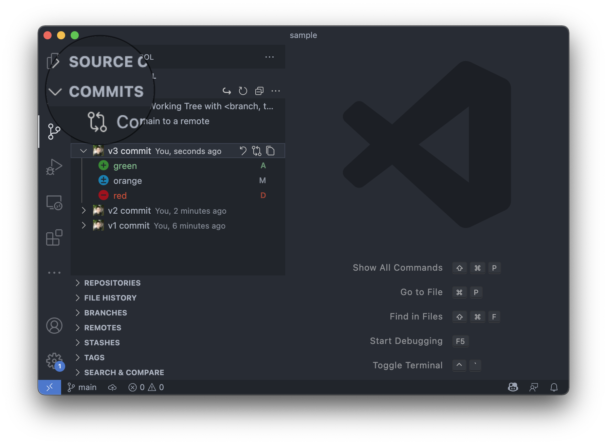
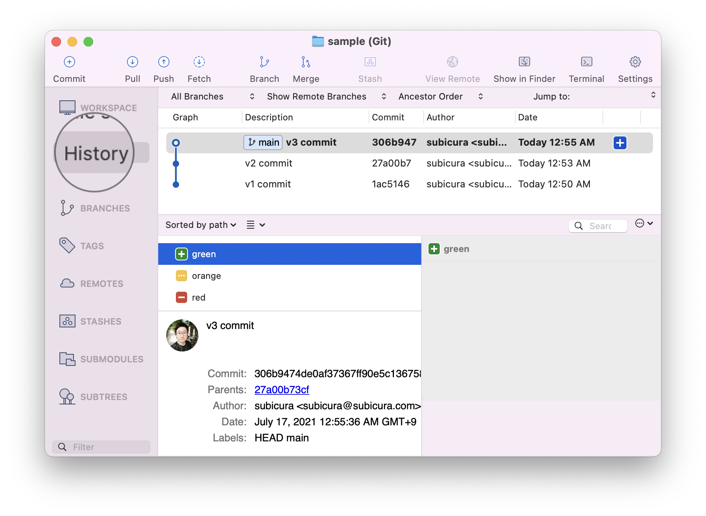

# 기본 명령어

::: tip ⚡️ 목표
저장소 생성부터 기본적인 이력 관리 방법을 알아봅니다.
:::

Git의 세계에 오신 걸 환영합니다. 👋 Git도 처음이고 터미널도 처음이신가요? 일단, 터미널 또는 Git Bash를 열고 명령어를 하나씩 입력해 봅시다.  
CLI로 먼저 해보고, 다음은 Visual Studio Code와 Sourcetree로 실습합니다.

## git init - 저장소 만들기

<usage text="git init" />

로컬 Git 저장소를 설정합니다.

### 작업

1. `sample` 폴더 생성
2. `red`, `orange` 파일 추가
3. `sample` 디렉토리를 로컬 저장소로 설정

### 실습

```sh{6}
mkdir sample
cd sample
touch red orange
echo "빨강" >> red
echo "주황" >> orange
git init
```

:::tip mkdir, cd, touch, echo 명령어
터미널 명령어를 소개합니다. ~~Git도 배우고 터미널 명령어도 배우고 1석2조!~~

- `mkdir`: 디렉토리 생성
- `cd`: 디렉토리로 이동
- `touch`: 빈 파일 생성
- `echo "[글자]" >> [파일]`: 파일에 글자 추가
  :::

**결과**

```sh
Initialized empty Git repository in /Users/cs.kim/Workspace/github.com/subicura/sample/.git/
```

- `sample` 디렉토리에 Git 저장소 생성
- 디렉토리 하위에 `.git` 폴더 생성 - Git과 관련된 정보 저장
- 쉘 프롬프트가 `➜ sample`에서 `➜ sample git:(main) ✗`로 변경

::: warning main branch
기본 브랜치 설정이 master인 경우 main 대신 master로 설정됩니다. 최근 master 대신 main을 쓰는 추세고 master로 설정되었다면 `git branch -M main` 명령어로 브랜치를 main으로 변경해주세요.
:::

## git status - 현재 상태 확인

<usage text="git status" />

현재 작업 중인 파일의 상태를 확인합니다.

### 작업

1. 상태 확인

### 실습

```sh{1}
git status # gst
```

**결과**

```sh
On branch main

No commits yet

Untracked files:
  (use "git add <file>..." to include in what will be committed)
	orange
	red

nothing added to commit but untracked files present (use "git add" to track)
```

- 현재 브랜치(main)와 커밋 상태, 작업 중인 파일의 상태를 확인
- untracked files(추적하지 않는 파일)이 존재하는 것을 확인

## git add - 현재 상태 추적

<usage text="git add [-A] [<pathspec>…​]" />

파일의 변경사항을 인덱스<sub>index</sub>에 추가합니다. Git은 커밋하기 전, 인덱스에 먼저 커밋할 파일을 추가합니다.

### 작업

1. `-A` 옵션을 이용하여 전체 파일(`orange`, `red`)을 인덱스에 추가
2. 상태 확인

### 실습

```sh{1,2}
git add -A # gaa
git status # gst
```

**결과**

```sh
On branch main

No commits yet

Changes to be committed:
  (use "git rm --cached <file>..." to unstage)
	new file:   orange
	new file:   red
```

- untracked files에 있던 `orange`와 `red`의 상태가 변경된 것을 확인

## git commit - 현재 상태 저장

<usage text="git commit [-m <msg>]" />

인덱스에 추가된 변경 사항을 이력에 추가합니다.

### 작업

1. `-m` 옵션을 이용하여 첫 번째 이력에 대한 메시지를 작성

### 실습

```sh{1}
git commit -m "v1 commit" # gc -m "v1 commit"
```

**결과**

```sh
[main (root-commit) 25354ae] v1 commit
 2 files changed, 0 insertions(+), 0 deletions(-)
 create mode 100644 orange
 create mode 100644 red
```

첫 번째 의미 있는 버전 관리 이력을 생성하였습니다! 🎉

---

**현재 Git 저장소 이력**


---

## 새 파일 추가

앞에서 했던 것과 동일한 방식으로 `yellow` 파일을 추가합니다.

### 작업

1. `yellow` 파일을 만듭니다.
2. 상태 확인

### 실습

```sh
touch yellow
echo "노랑" >> yellow
git status # gst
```

**결과**

```sh
On branch main
Untracked files:
  (use "git add <file>..." to include in what will be committed)
	yellow

nothing added to commit but untracked files present (use "git add" to track)
```

## 새 파일 커밋

### 작업

1. 직전 커밋 이후 변경된 전체 파일(`yellow`)을 인덱스에 추가
2. 두 번째 이력 커밋

### 실습

```sh
git add -A # gaa
git commit -m "v2 commit" # gc -m "v2 commit"
```

---

**현재 Git 저장소 이력**


---

## 다양한 변화

추가/수정/삭제를 이용한 세 번째 이력을 만듭니다.

### 작업

1. `red` 삭제
2. `orange`에 내용 추가
3. `green` 파일 추가

### 실습

```sh
rm red
echo "오렌지" >> orange
touch green
git status # gst
git add -A # gaa
git commit -m "v3 commit" # gc -m "v3 commit"
```

**결과**

```sh
On branch main
Changes not staged for commit:
  (use "git add/rm <file>..." to update what will be committed)
  (use "git restore <file>..." to discard changes in working directory)
	modified:   orange
	deleted:    red

Untracked files:
  (use "git add <file>..." to include in what will be committed)
	green

no changes added to commit (use "git add" and/or "git commit -a")
```

- `orange`를 수정했고 `red`는 삭제, `green`은 새로 만들어진 것을 확인

---

**현재 Git 저장소 이력**


---

## git log - 이력 확인

<usage text="git log [<options>] [<revision range>] [[--] <path>…​]" />

이번 실습에선, 추가 옵션 없이 `git log`만 사용합니다. `git log`는 다양한 옵션을 조합하여 원하는 형태의 로그를 출력할 수 있는 강력한 기능입니다.

### 작업

1. 전체 로그 확인

### 실습

```sh{1}
git log
```

**결과**

```sh
commit 306b9474de0af37367ff90e5c1367588413f81bf (HEAD -> main)
Author: subicura <subicura@subicura.com>
Date:   Sat Jul 17 00:55:36 2021 +0900

    v3 commit

commit 27a00b73cf7ab2e70e8dd5e5235bf7f94e9ddd84
Author: subicura <subicura@subicura.com>
Date:   Sat Jul 17 00:53:50 2021 +0900

    v2 commit

commit 1ac5146ad27c5277996d54c08ec4ccded0edd4e3
Author: subicura <subicura@subicura.com>
Date:   Sat Jul 17 00:50:30 2021 +0900

    v1 commit
```

- 전체 커밋 메시지 확인

## git reset - 이전 상태로 (이력 제거)

<usage text="git reset [<commit>] [--soft | --mixed [-N] | --hard | --merge | --keep]" />

특정 커밋까지 이력을 초기화합니다. 바로 전, 또는 n번 전까지 작업했던 내용을 취소할 수 있습니다. 열심히 작업했는데, 전혀 엉뚱한 걸 했거나 작업한 내용이 필요 없어질 때 사용할 수 있지만, 이력이 지워지기 때문에 주의해야 합니다.

`git reset`은 다양한 옵션이 존재하는데 여기선 `--hard` 옵션을 사용합니다.

### 작업

1. `git log`로 2번 커밋 ID 조회
2. 2번 커밋까지 이력 초기화

### 실습

```sh{2}
git log
git reset {v2 커밋 아이디} --hard # 커밋 아이디 예) 27a00b7 (앞에 7자 정도 복사)
```

**결과**

```sh
HEAD is now at 27a00b7 v2 commit
```

- 2번 커밋까지 이력 초기화 -> 결론적으로 3번 이력 삭제 확인
- 지웠던 `red`가 되살아나고 `orange` 내용이 수정되고 `green` 파일이 사라진 것을 확인

---

**현재 Git 저장소 이력**


---

## git revert - 이전 상태로 (이력 유지)

<usage text="git revert <commit>…​" />

특정 커밋을 취소하는 새로운 커밋을 만듭니다. 여기선 3번 커밋을 취소하는 새로운 커밋을 생성하여 마치 2번 커밋 상태로 돌아간 것 같지만 기존 이력을 유지하는 모습을 확인합니다.

일반적으로 특정 버전을 배포했는데 문제가 생기면 문제가 생긴 커밋을 `revert`하고 다른 작업을 하다가 해당 문제를 수정하면 다시 커밋하는 방식을 사용합니다.

### 작업

1. `git reset` 명령어로 3번 커밋이 지워졌다면 이전 실습을 통해 다시 커밋 추가
2. `git log`로 3번 커밋 ID 조회
3. 3번 커밋 취소

### 실습

```sh{2}
git log
git revert {v3 커밋 아이디} # 커밋 아이디 예) 306b947 (앞에 7자 정도 복사)
git log
```

> vi 창이 열리고 메시지를 입력하는 화면이 나오면 당황하지 말고 `ecs`키를 누르고 `:x`를 차례로 입력한 다음 엔터를 칩니다.

**결과**

```sh
Removing green
[main 5a9a926] Revert "v3 commit"
 3 files changed, 1 insertion(+), 1 deletion(-)
 delete mode 100644 green
 create mode 100644 red
```

- 지웠던 `red`가 되살아나고 `orange` 내용이 수정되고 `green` 파일이 사라진 것을 확인
- `git log`를 통해 새로운 커밋이 추가된 것을 확인

---

**현재 Git 저장소 이력**


---

## GUI 도구 사용하기

지금까지 작업을 Visual Studio Code와 Sourcetree로 처음부터 해보고 어떤 장점이 있는지 확인해 보겠습니다.

### Visual Studio Code

조금 전 실습한 내용을 Visual Studio Code로 해봅니다. `git init`까지 CLI로 진행하고 해당 폴더를 Visual Studio Code로 엽니다.

왼쪽 `Source Control` 메뉴를 선택합니다.


`orange`, `red` 파일이 `U`(untracked) 상태인 것을 확인할 수 있습니다. Visual Studio Code는 해당 메뉴에서 현재 작업 상태를 실시간으로 확인할 수 있습니다.

해당 파일을 익덱스에 추가해 봅니다.


Changes 탭 옆에 `+` 버튼을 누릅니다.


`orange`, `red` 파일의 상태가 `A`(add)로 바뀐 것을 확인할 수 있습니다.

이제 커밋 메시지를 작성해 봅니다.


메시지 입력창에 메시지 입력 후 `체크아이콘`을 선택합니다. 첫 번째 커밋을 작성했습니다. 🎉

에디터에 내장된 버전 관리 기능을 사용하면 터미널을 켜지 않고 손쉽게 버전을 관리할 수 있습니다. 앞에서 실습한 것처럼 2번, 3번 커밋도 작성해봅니다. 실시간으로 현재 상태를 확인하고 메시지 입력 후 클릭 몇 번이면 커밋을 작성할 수 있습니다.

이력을 확인하기 위해 COMMITS 탭을 선택합니다.



커밋 이력과 파일 상태를 확인할 수 있습니다.


로그만 좀 더 자세히 보기 위해 `shift` + `ctrl`+`p` 또는 `shift` + `⌘`+`p`를 누른 후 `git log` 를 검색하여 `Git: View History (git log)`를 선택합니다.


`Git History` 플러그인이 제공하는 화면이 좀 더 시원시원한 것을 확인할 수 있습니다.

CLI를 이용하여 `git reset`을 할 때 귀찮은 점은 커밋 ID를 복사하는 작업입니다. Visual Studio Code에서는 커밋 로그를 확인하고 마우스 클릭으로 동일한 작업을 손쉽게 할 수 있습니다.


COMMITS 목록에서 2번 항목을 오른쪽 버튼 누르고 `Reset Current Branch to Commit`을 선택합니다. 참 쉽죠?

다시 3번째 커밋을 되살리고, 이번엔 `git revert` 명령을 사용해봅니다.


COMMITS 목록에서 3번 항목을 오른쪽 버튼 누르고 `Revert Commit`을 선택합니다. 실시간으로 추가되는 로그가 보이시죠?

### Sourcetree

Sourcetree는 버전 관리에 특화된 애플리케이션으로 이력을 보기가 좀 더 편하다는 장점이 있습니다. 조금 전 실습한 내용을 Sourcetree로 해봅니다. `git init`까지 CLI로 진행하고 해당 폴더를 Sourcetree로 연다음 작업합니다.

<div class="image-450">


</div>

추가된 저장소를 더블 클릭합니다.


`orange`, `red` 파일이 `?`(untracked) 상태인 것을 확인할 수 있습니다.


파일 선택 후 오른쪽 `...`에서 `Stage File`을 선택하거나, `Unstaged files` 좌측 체크박스를 선택하면


`orange`, `red` 파일이 `Unstaged files` 목록에서 `Staged files` 목록으로 이동합니다.


하단 텍스트 박스에 메시지 입력 후 `Commit` 버튼을 클릭합니다. 첫 번째 커밋을 작성했습니다. 🎉

앞에서 실습한 것처럼 2번째, 3번째 커밋도 작성해봅니다. 실시간으로 현재 상태를 확인하고 메시지 입력 후 클릭 몇 번이면 커밋을 작성할 수 있습니다.



이력을 확인하기 위해 좌측메뉴에서 `History`를 선택합니다.

`git reset` 명령어를 Sourcetree로 실행해보겠습니다.


History 목록에서 2번 항목을 오른쪽 버튼 누르고 `Reset main to this commit`를 선택합니다.

추가 적으로 옵션을 선택하는 창이 뜨는데 `Hard Reset`을 선택하면 이력이 사라진다는 경고를 합니다. 바로 이력이 사라지는 Visual Studio Code와 달리 조금 더 친절한 것 같네요.

다시 3번 커밋을 되살리고, 이번엔 `git revert` 명령을 Sourcetree로 해봅니다.


History 목록에서 3번 항목 오른쪽 버튼을 누르고 `Reverse Commit...`을 선택합니다. 왜 Revert가 아니고 Reverse인지는 모르겠지만, Sourcetree에서 사용하는 방식 같습니다.

## 그래서

Git의 가장 기본이 되는 기능을 실습했습니다. 이제 자유롭게 변경 사항을 커밋하고 원하는 이력으로 되돌아갈 수 있습니다.

CLI는 분명 필수적으로 알아야 하지만, 몇가지 불편한 점이 있습니다. 현재 상태를 확인하려면 매번 `git status`를 입력해야 하고, 특정 커밋으로 돌아가려면 로그를 확인하고 커밋 ID를 하나하나 복사 붙여넣기 해야 하는 불편함이 있습니다.

Visual Studio Code와 Sourcetree는 CLI보다 편한 점이 있습니다.

기본적인 작업은 개발 생산성을 고려하여 Visual Studio Code와 같은 에디터에 내장된 버전 관리 시스템을 이용하고 reset이나 revert같은 작업은 이력이 좀 더 이쁘게 출력되는 Sourcetree 같은 버전 관리 전용 프로그램을 추천합니다.
