# 작업 분기

::: tip ⚡️ 목표
브랜치 기능을 이용하여 동시에 여러 작업을 진행하고 합치고 충돌을 해결하는 방법을 알아봅니다.
:::

Git은 강력한 브랜치 기능을 이용하여 비선형적인 개발이 가능합니다.  
한 작업이 끝나고 다음 작업을 진행한 다음, 그 작업이 끝난 후 그다음 작업을 하는 것이 아니라 동시에 여러 작업을 진행하고 최종적으로 합치는 과정을 자연스럽게 할 수 있습니다.  
그 과정에서 동일한 파일을 수정하면 충돌이 발생하고 그 충돌을 해결하는 과정에서 첫 번째 난관이 발생하는데 😭 협업을 하려면 반드시 거쳐야 하는 작업입니다.

앞에서 실습한 브랜치는 `main` 브랜치입니다. `main` 브랜치에서 새로운 브랜치를 만들면서 작업할 예정입니다. 브랜치는 고유의 작업 공간을 가지고 있기 때문에 서로 영향을 받지 않고 빠르게 브랜치를 전환할 수 있습니다. 특정 브랜치의 작업이 완료되면 수정 사항을 다른 브랜치에 합칠 수 있습니다.

## git switch -c - 브랜치 생성

<usage text="git switch (-c|-C) <new-branch>" />

`main` 브랜치에서 `add-color` 브랜치를 만듭니다.

:::tip 브랜치 생성
새 브랜치를 만들 때, 현재 브랜치의 상태를 기준으로 만들기 때문에 현재 브랜치가 무엇인지 꼭 확인해야 합니다.
:::

**작업**

1. 앞에서 실습한 4개의 커밋이 있는 저장소에서 `-c` 옵션으로 `add-color` 브랜치를 생성하면서 이동

**실습**

```sh{2}
# git checkout -b add-color # 예전 Git 버전 명령어
git switch -c add-color # gsw -c add-color
```

:::warning `-c` 옵션
git switch의 `-c` 옵션은 브랜치 생성과 브랜치 이동을 한번에 수행합니다. 다음 명령어와 동일합니다.

```sh
git branch add-color
git swtich add-color
```

:::

**결과**

```sh
Switched to a new branch 'add-color'
```

- 기존 `main` 브랜치의 작업 공간과 동일한 `add-color` 브랜치를 생성하면서 이동
- 쉘 프롬프트가 `➜ sample git:(main)`에서 `➜ sample git:(add-color)`로 변경

## add-color 브랜치에서 작업

새 브랜치에서 새 커밋을 작성합니다.

**작업**

1. `green`, `blue` 파일 추가
2. 전체 변경사항을 인덱스에 추가
3. 커밋 작성

**실습**

```sh
touch green blue
echo "녹색" >> green
echo "파랑" >> blue
git add -A # gaa
git commit -m "add green, blue" # gc -m "add green, blue"
```

**결과**

```sh
[add-color 1b528c8] add green, blue
 2 files changed, 2 insertions(+)
 create mode 100644 blue
 create mode 100644 green
```

## git switch - 브랜치 변경

`add-color` 브랜치에서 진행한 작업이 기존 `main` 브랜치와 독립적인 것을 확인합니다.

**작업**

1. `main` 브랜치로 이동

**실습**

```sh{2}
# git checkout main # 예전 Git 버전 명령어
git switch main # gsw main, gsw 한칸 띄고 <tab>을 눌러보세요
```

**결과**

```sh
Switched to branch 'main'
```

- 쉘 프롬프트가 `➜ sample git:(add-color)`에서 `➜ sample git:(main)`로 변경
- `add-color` 브랜치에서 추가한 `green`, `blue` 파일이 사라지고 이전 상태로 돌아온 것을 확인

## update-red 브랜치 추가

**작업**

1. `update-red` 브랜치 생성 후 이동
2. `red` 파일 내용 변경
3. 전체 변경사항을 인덱스에 추가
4. 커밋 작성

**실습**

```sh
# git checkout -b update-red # 예전 Git 버전 명령어
git switch -c update-red # gsw -c update-red
echo "붉은색" > red
git add -A # gaa
git commit -m "update red" # gc -m "update red"
```

**결과**

```sh
Switched to a new branch 'update-red'
[update-red 57ca6bc] update red
 1 file changed, 1 insertion(+), 1 deletion(-)
```

**현재 브랜치 상황**

- `main`: `red`, `orange`, `yellow`
- `add-color`: `red`, `orange`, `yellow`, `green`, `blue`
- `update-red`: `red(변경)`, `orange`, `yellow`

## git merge - 브랜치 합치기

<usage text="git merge [<commit>…​]" />

`add-color`에서 작업한 내용을 `main`에 합칩니다.  
`add-color`와 `main` 브랜치의 차이는 `green`과 `blue` 파일이 추가된 것인데, Git은 동일한 파일을 수정하지 않으면 자동으로 머지합니다. 같은 파일을 수정했더라도 서로 다른 줄을 수정하면 자동 머지 되는데 참 똑똑합니다.

**작업**

1. `main` 브랜치로 이동
2. `add-color` 브랜치의 수정사항을 `main` 브랜치로 머지
3. 전체 커밋 메시지 확인

**실습**

```sh{2}
git switch main # gsw main
git merge add-color # gm add-color
git log
```

**결과**

```sh
Merge made by the 'recursive' strategy.
 blue  | 1 +
 green | 1 +
 2 files changed, 2 insertions(+)
 create mode 100644 blue
 create mode 100644 green
```

- `add-color`에서 작업한 내용(파일 추가)이 `main` 브랜치로 머지됨
- `main` 브랜치에 `green`, `blue` 파일이 추가된 것을 확인
- `add-color`에서 작성한 커밋 로그가 `main` 브랜치에도 추가된 것 확인
- 첫번째 머지 축하합니다. 🎉

## conflict - 충돌 해결

지금까지 1. 브랜치를 만들고 2. 해당 브랜치에서 커밋을 하고 3. 다른 브랜치와 머지하는 작업을 진행했습니다.  
대부분 협업을 할때 서로 다른 작업을 하므로 보통 문제없이 자동으로 머지됩니다. **하지만,** 같은 파일을 부득이 수정하는 경우가 생기고 필연적으로 충돌이 발생하는데, 강제로 상황을 만들고 충돌을 해결하는 방법을 알아보겠습니다.

`update-red` 브랜치에서 수정한 `red` 파일을 `main` 브랜치에서도 수정하여 충돌 상황을 만듭니다.

**작업**

1. `main` 브랜치에서 `red` 파일 수정
2. 전체 변경사항을 인덱스에 추가
3. 커밋 작성
4. `update-red` 브랜치를 `main`으로 머지

**실습**

```sh
echo "뻘건색" > red
git add -A # gaa
git commit -m "update red color" # gc -m "update red color"
git merge update-red # gm update-red
```

**결과**

```sh
Auto-merging red
CONFLICT (content): Merge conflict in red
Automatic merge failed; fix conflicts and then commit the result.
```

- `CONFLICT`라는 메시지와 함께 실패(failed)

:::warning CONFLICT
충돌은 정말 마주치고 싶지 않은 상황입니다. 하지만, 상황이 발생했으면 해결을 해야겠죠.  
충돌을 해결하고 커밋을 하거나, 머지 작업을 취소(`git merge --abort`)할 수 있습니다.
:::

**red 파일 내용**

```
<<<<<<< HEAD
뻘건색
=======
붉은색
>>>>>>> update-red
```

충돌이 발생하면 양쪽 브랜치에서 동시에 변경된 사항을 표시해 줍니다. `<<<<<<<`, `=======`, `>>>>>>>` 이 내용이 충돌이 발생한 지점을 의미합니다.

위에 내용은 `main` 브랜치에서 작업한 내용이고 아래 내용은 `update-red` 브랜치에서 작업한 내용이네요. 둘중에 어떤 내용이 맞는지 개발자가 스스로 판단하고 선택해야 합니다.

여기선, `붉은색`만 남기고 다른 줄을 삭제합니다. `<<<<<<<`, `뻘건색`, `=======`, `>>>>>>>`를 모두 제거합니다.

충돌을 해결했다면 기존과 동일한 방식으로 커밋을 진행합니다. 차이점은 `git commit`에서 `-m` 메시지를 입력하지 않는다는 점입니다. 충돌을 수정한 내용을 자동으로 메시지로 만들기 때문에 따로 입력하지 않아도 됩니다.

```sh{2}
git add -A # gaa
git commit # gc
```

> vi 창이 열리고 메시지를 입력하는 화면이 나오면 당황하지말고 `ecs`키를 누르고 `:x`를 차례로 입력한 다음 엔터를 칩니다.

**결과**

```
[main bb77c83] Merge branch 'update-red'
```

충돌을 해결하고 머지되었습니다! 🎉

## GUI 도구 사용하기

지금까지 작업을 `Visual Studio Code`와 `Sourcetree`로 해보고 어떤 장점이 있는지 확인해 보겠습니다.

### Visual Studio Code

현재 브랜치가 무엇인지 확인하고 새 브랜치를 생성합니다.

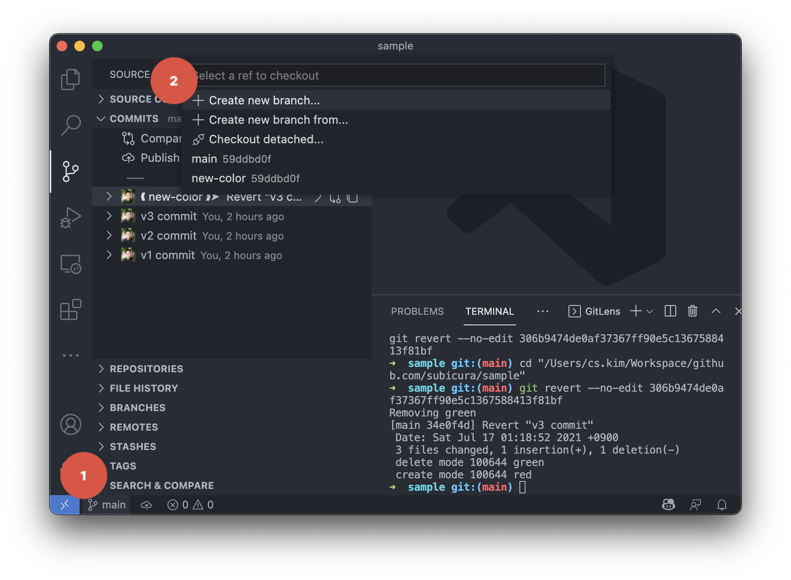

왼쪽밑에 현재 브랜치명인 `main`을 누르고 `+ Create new branch...`를 선택합니다. `add-color` 를 입력하면, 새 브랜치가 생성되고 해당 브랜치로 이동합니다.

이제 `add-color` 브랜치에서 앞에서 실습한 커밋을 추가합니다. 커밋을 추가했으면, 다시 `main` 브랜치로 돌아와 봅시다.

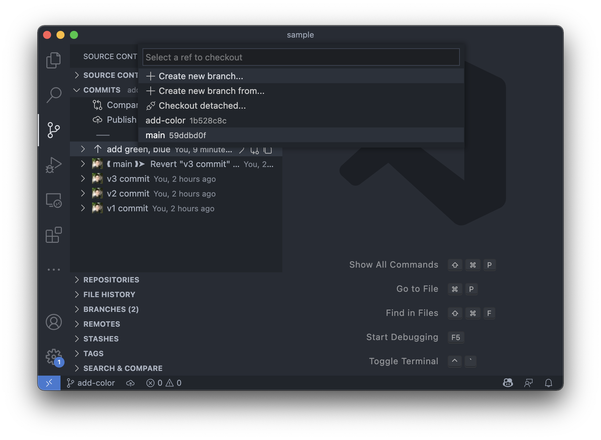

왼쪽밑에 현재 브랜치명인 `add-color`를 누르고 `main`을 선택합니다. 브랜치가 많아질수록 브랜치 이름을 외울 수 없고 브랜치를 이동할 때 정확하게 브랜치명을 입력해야 하는데, CLI 보다는 이렇게 눈으로 확인하고 클릭하는 것이 더 편하고 정확합니다. 언제든 클릭 몇 번으로 브랜치를 손쉽게 이동할 수 있습니다.

이제 `add-color` 브랜치의 변경사항을 `main`에 머지합니다.

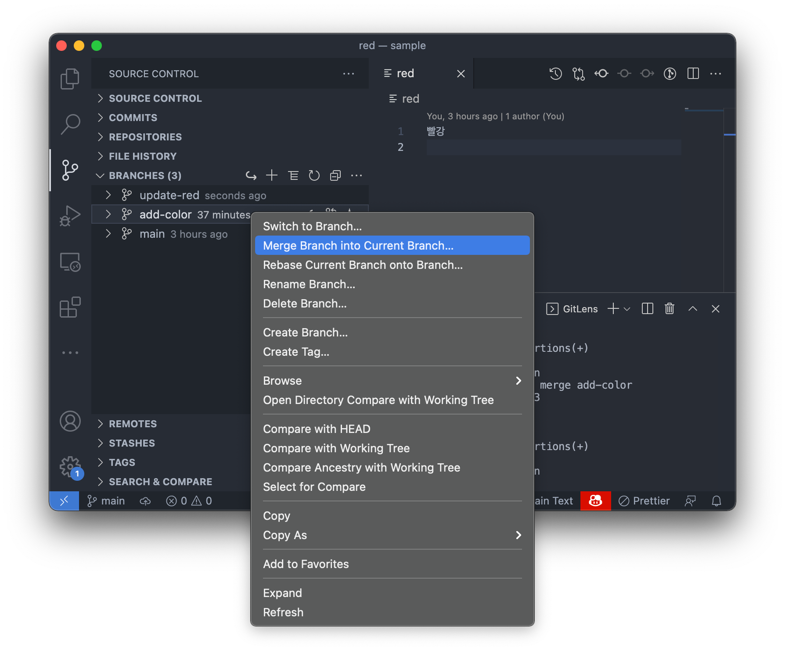

`Source Control`에서 `BRANCHES 탭`을 선택하고 `add-color` 브랜치에서 오른쪽 버튼 클릭 후 `Merge Branch into Current Branch...`를 선택합니다. 머지 옵션이 뜨는데 기본값 `Merge`를 선택합니다. 머지 완료!

그럼, 충돌 상황을 만들고 해결해 봅니다. `update-red` 브랜치를 만들고 파일을 수정한다음에 `main` 브랜치로 돌아옵니다.

`BRANCHES 탭`을 선택하고 `update-red` 브랜치에서 오른쪽 버튼 클릭 후 `Merge`를 선택합니다.

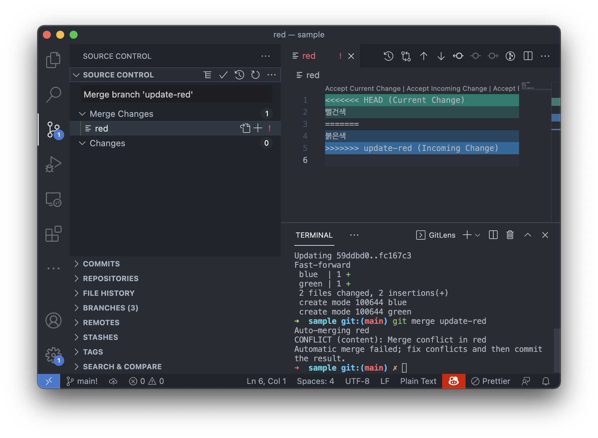

충돌난 파일이 보이고, 어떤 브랜치의 수정사항을 고를지 선택하는 버튼도 보입니다. 내용을 수정하고 저장합니다.

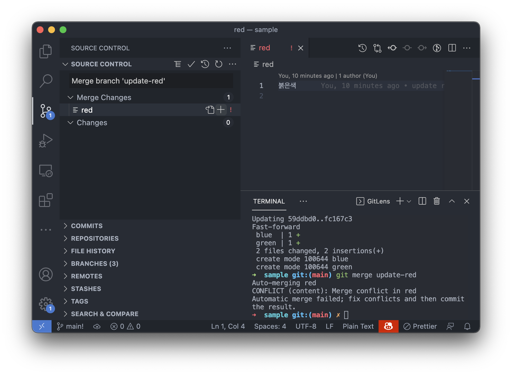

수정이 완료되면 `+`를 누르고 `체크버튼`을 선택하여 커밋합니다. 머지 완료!

### Source Tree

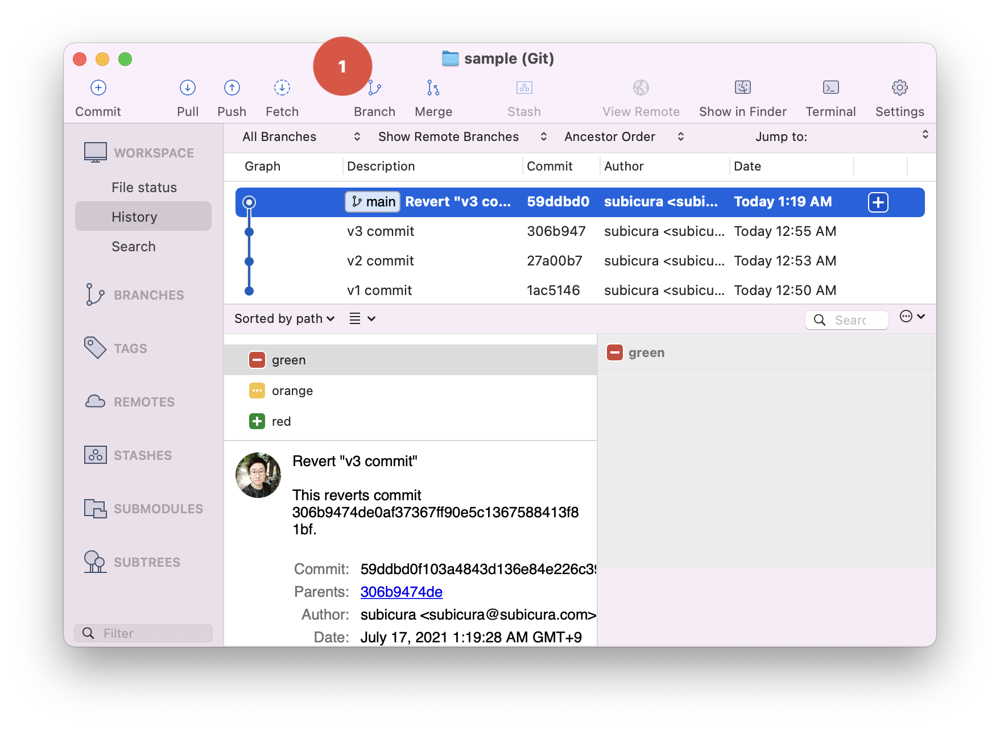

상단 메뉴에서 `Branch`를 선택합니다.

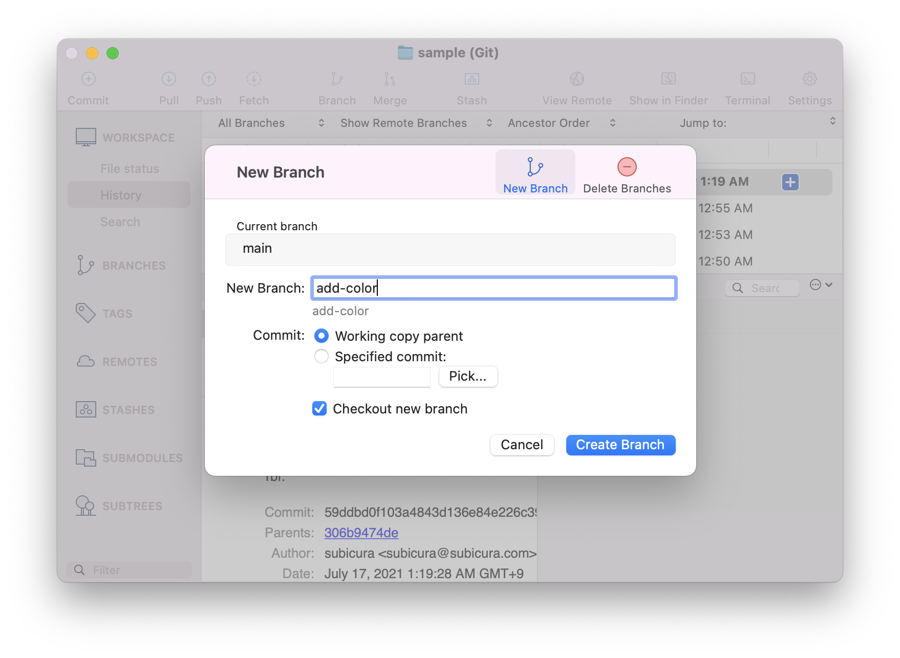

새로 뜨는 팝업에서 `add-color` 입력 후 `Create Branch` 클릭합니다.

이제 `add-color` 브랜치에서 앞에서 실습한 커밋을 추가합니다. 커밋을 추가했으면, 다시 `main` 브랜치로 돌아와 봅시다.

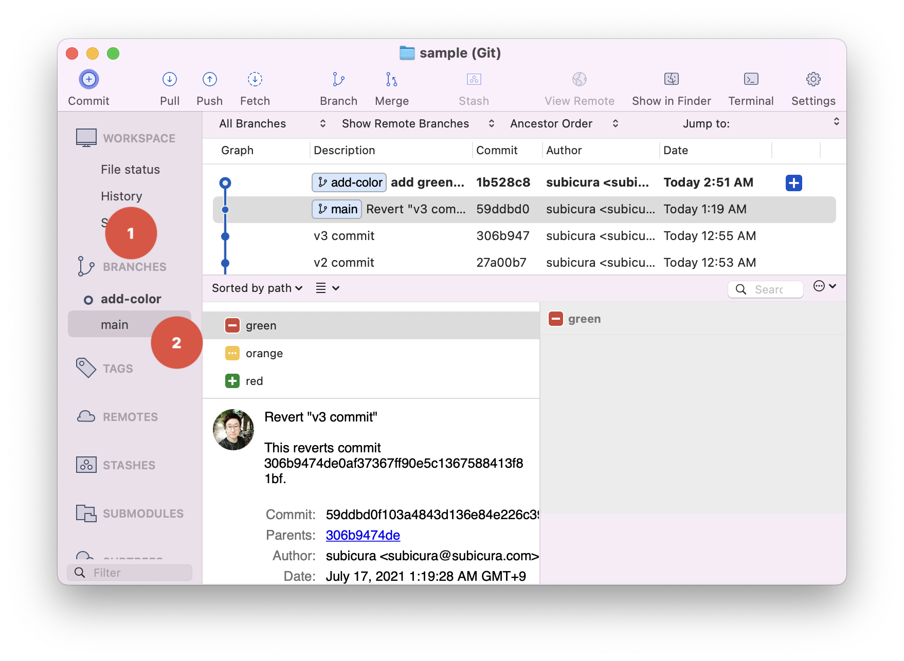

왼쪽 메뉴에서 `Branch`를 확장하고 `main`을 더블클릭합니다. 언제든 브랜치명을 더블 클릭하면 자유롭게 브랜치를 이동할 수 있습니다.


왼쪽 메뉴에서 `Branch`를 확장하고 `add-color`에서 오른쪽 버튼 클릭 후 `Merge add-color into main`를 선택합니다. 머지 완료!

그럼, 충돌 상황을 만들고 해결해 봅니다. `update-red` 브랜치를 만들고 파일을 수정한다음에 `main` 브랜치로 돌아옵니다.

`update-red` 브랜치에서 오른쪽 버튼 누르고 `Merge`를 선택합니다.

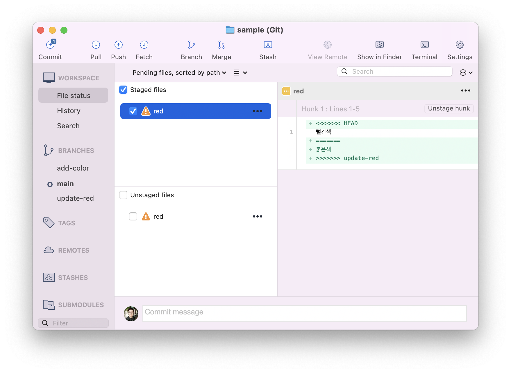

충돌 발생한 `red` 파일 내용을 볼 수 있습니다. 해당 파일을 더블 클릭하거나 에디터로 열어서 편집합니다.

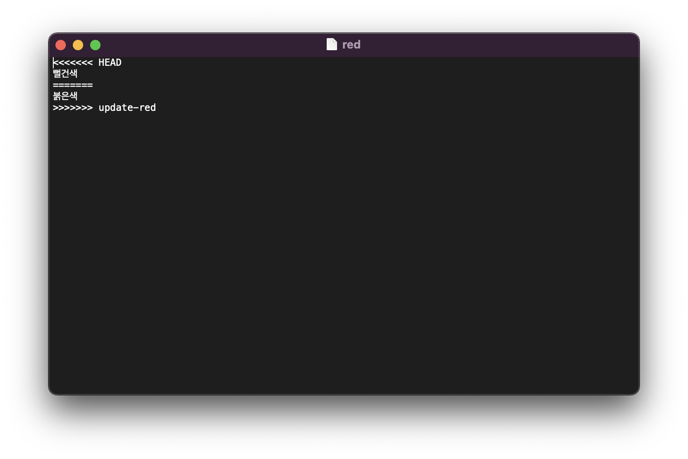

메모장에서 `붉은색`만 남기고 지운 다음 저장합니다.

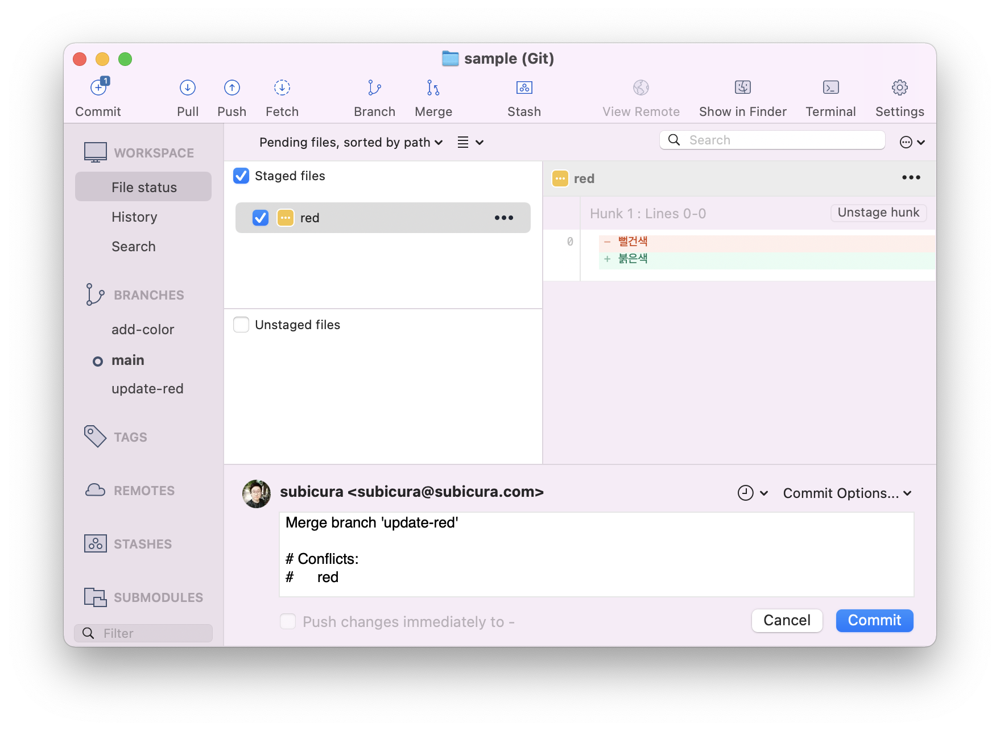

수정이 완료되면 Stage에 추가하고 `Commit` 버튼을 클릭합니다. 머지 완료!

## 그래서

Git에서 제공하는 강력한 브랜치 기능을 실습했습니다. 이제 자유롭게 브랜치를 만들고 작업하고 머지할 수 있습니다.

대부분의 에디터에서 메인 화면 한쪽 구석에 브랜치명을 표시해 줍니다. 현재 어떤 브랜치에서 작업하고 있는지 인지하는 것이 중요하고 필요하면 언제든 빠르게 변경할 수 있도록 보기 좋은 곳에 표시합니다. CLI를 쓰는 것도 좋지만 이렇게 편한 위치에 있는 기능을 쓰면 생산성에 도움이 되겠죠?
