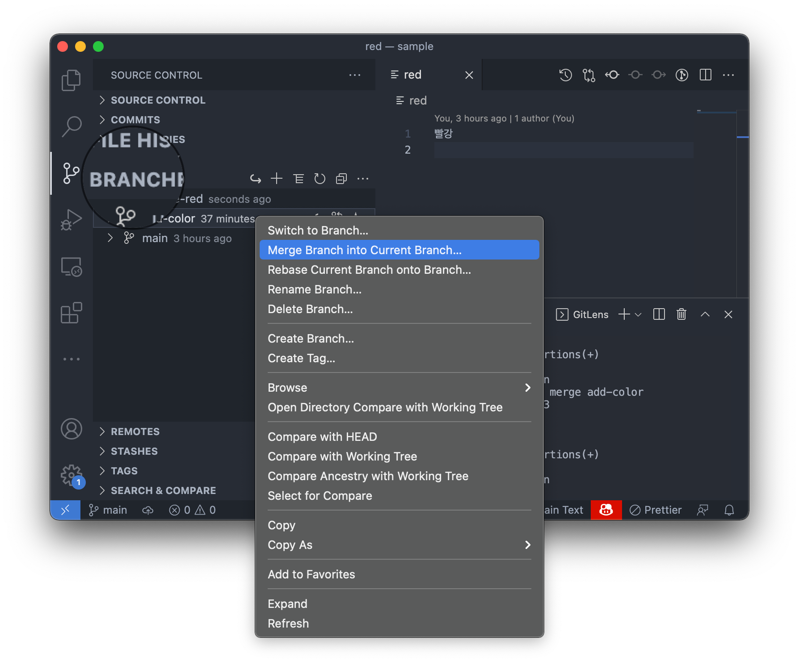
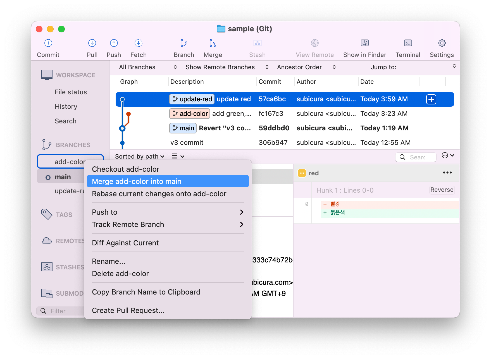

# 작업 분기

::: tip ⚡️ 목표
동시에 여러 작업을 진행하고 합치고 충돌을 해결하는 방법을 알아봅니다.
:::

Git은 강력한 브랜치 기능을 이용하여 비선형적인 개발이 가능합니다.  
한 작업이 끝나고 다음 작업을 진행한 다음, 그 작업이 끝난 후 그 다음 작업을 하는 것이 아니라 동시에 여러 작업을 진행하고 최종적으로 합치는 과정을 자연스럽게 할 수 있습니다. 그 과정에서 동일한 파일을 수정하면 충돌이 발생하고 그 충돌을 해결하는 과정에서 첫번째 난관이 발생하는데 협업을 하려면 반드시 거쳐야 하는 작업입니다.

기존에 의식하지 않았지만 `main` 브랜치에서 작업을 하고 있었습니다. 이제 `main` 브랜치에서 새로운 브랜치를 만들면서 작업을 해보겠습니다. 브랜치는 고유의 작업 공간을 가지고 있기 때문에 서로 영향을 받지 않고 작업을 하다가 필요할 때 합칠 수 있습니다.

## git switch -c - 브랜치 생성

`main`브랜치에서 `add-color`라는 브랜치를 만듭니다.

### CLI

```sh{2}
# git checkout -b add-color # 예전 Git 버전
git switch -c add-color # gsw -c add-color
```

**결과**

```sh
Switched to a new branch 'add-color'
```

- 쉘 프롬프트가 `➜ sample git:(main)`에서 `➜ sample git:(add-color)`로 변경

### Visual Studio Code


- 왼쪽밑에 현재 브랜치명인 `main`을 누르고 `+ Create new branch...`를 선택
- `add-color` 입력 후 엔터

### Sourcetree


- 상단 메뉴에서 `Branch`를 선택


- 새로 뜨는 팝업에서 `add-color` 입력 후 `Create Branch` 클릭

## add-color 브랜치에서 작업

`main`브랜치에서 `add-color`라는 브랜치를 만듭니다.

### CLI

```sh{4,5}
touch green blue
echo "녹색" >> green
echo "파랑" >> blue
git add -A # gaa
git commit -m "add green, blue" # gc -m "add green, blue"
```

**결과**

```sh
[add-color 1b528c8] add green, blue
 2 files changed, 2 insertions(+)
 create mode 100644 blue
 create mode 100644 green
```

### Visual Studio Code / Sourcetree

::: tip 실습
`green`, `blue` 파일을 추가하고 커밋합니다.
:::

## git switch - 브랜치 변경

`add-color` 브랜치에서 새로운 커밋을 추가했으니 `main` 브랜치로 변경합니다.

### CLI

```sh{2}
# git checkout main # 예전 Git 버전
git switch main # gsw main, gsw 한칸 띄고 <tab>을 눌러보세요
```

**결과**

```sh
Switched to branch 'main'
```

- 쉘 프롬프트가 `➜ sample git:(add-color)`에서 `➜ sample git:(main)`로 변경
- `add-color` 브랜치에서 추가한 `green`, `blue` 파일이 사라지고 이전 상태로 돌아온 것을 확인

### Visual Studio Code


- 왼쪽밑에 현재 브랜치명인 `add-color`를 누르고 `main`을 선택

### Sourcetree


- 왼쪽 메뉴에서 `Branch`를 확장하고 `main`을 더블클릭

## update-red 브랜치 추가

### CLI

```sh{2,4,5}
# git checkout -b update-red # 예전 Git 버전
git switch -c update-red # gsw -c update-red
echo "붉은색" > red
git add -A # gaa
git commit -m "update red" # gc -m "update red"
```

**결과**

```sh
Switched to a new branch 'update-red'
[update-red 57ca6bc] update red
 1 file changed, 1 insertion(+), 1 deletion(-)
```

- `main` 브랜치에서 `update-red` 브랜치를 만들고 해당 브랜치에서 `red`파일 수정
- 현재 브랜치 상황
  - `main`: `red`, `orange`, `yellow`
  - `add-color`: `red`, `orange`, `yellow`, `green`, `blue`
  - `update-red`: `red(변경)`, `orange`, `yellow`

### Visual Studio Code / Sourcetree

::: tip 실습
`red` 파일을 수정하고 커밋합니다.
:::

## git merge - 브랜치 합치기

`add-color`에서 작업한 내용을 `main`에 합칩니다.

### CLI

```sh{1,2,3}
git switch main # gsw main
git merge add-color # gm add-color
git log
```

**결과**

```sh
Merge made by the 'recursive' strategy.
 blue  | 1 +
 green | 1 +
 2 files changed, 2 insertions(+)
 create mode 100644 blue
 create mode 100644 green
```

- `add-color`에서 작업한 내용이 `main` 브랜치로 머지됨
- `main` 브랜치에 `green`, `blue` 파일이 추가된 것을 확인
- `add-color`에서 작성한 커밋 로그가 `main` 브랜치에 추가된 것 확인

### Visual Studio Code



- `Source Control`에서 `BRANCHES 탭` 선택
- `add-color` 브랜치에서 오른쪽 버튼 클릭 후 `Merge Branch into Current Branch...` 선택

!!!warning merge 방식
Visual Studio Code에서 `Merge`를 하면 `Merge`, `Fast Forward`, `No Fast Forward`, `Squash`등을 선택할 수 있는데 우선 최상단 `Merge`를 선택합니다. 다른 메뉴는 추후에 알아봅시다.
!!!

### Sourcetree



- 왼쪽 메뉴에서 `Branch`를 확장하고 `add-color`에서 오른쪽 버튼 클릭 후 `Merge add-color into main` 선택

## conflict - 충돌 해결

지금까지 브랜치를 만들고 해당 브랜치에서 커밋을 하고 다른 브랜치와 머지하는 작업까지 진행했습니다. 대부분 협업을 할때 서로 겹치지 않는 작업을 진행하기 때문에 대부분 문제 없이 머지됩니다. 하지만, 같은 파일을 부득이 수정하는 경우가 생기는데 충돌을 해결하는 방법을 알아보겠습니다.

`red`파일을 수정하고 `update-red`브랜치를 머지해보겠습니다.

### CLI

```sh{2,3,4}
echo "뻘건색" > red
git add -A # gaa
git commit -m "update red color" # gc -m "update red color"
git merge update-red # gm update-red
```

**결과**

```sh
Auto-merging red
CONFLICT (content): Merge conflict in red
Automatic merge failed; fix conflicts and then commit the result.
```

- `CONFLICT`라는 메시지와 함께 실패(failed)했다고 표시

**red**

```
<<<<<<< HEAD
뻘건색
=======
붉은색
>>>>>>> update-red
```

- `main`브랜치와 `update-red`브랜치의 수정항목이 표시되고 고치도록 유도함
- `붉은색`만 남기고 다른 줄 삭제 (충돌 해결!)

```sh{1,2}
git add -A # gaa
git commit -a # gc
```

> vi 창이 열리고 메시지를 입력하는 화면이 나오면 당황하지말고 `ecs`키를 누르고 `:x`를 차례로 입력한 다음 엔터를 칩니다.

**결과**

```
[main bb77c83] Merge branch 'update-red'
```

- 충돌을 해결하고 `commit`을 입력하면 새로운 `Merge Commit`이 추가된 것을 확인

### Visual Studio Code

- `update-red` 브랜치에서 오른쪽 버튼 누르고 `Merge` 선택


- 어떤 브랜치의 수정사항을 고를지 선택창이 보임
- 수정 후 저장


- `+`를 누르고 `체크버튼`을 선택하여 commit

### Sourcetree

- `update-red` 브랜치에서 오른쪽 버튼 누르고 `Merge` 선택


- 충돌 발생한 `red` 파일 더블 클릭


- 새로운 메모장에서 `붉은색`만 남기고 지운 다음 저장


- 수정한 파일을 Stage에 추가하고 `Commit` 클릭
