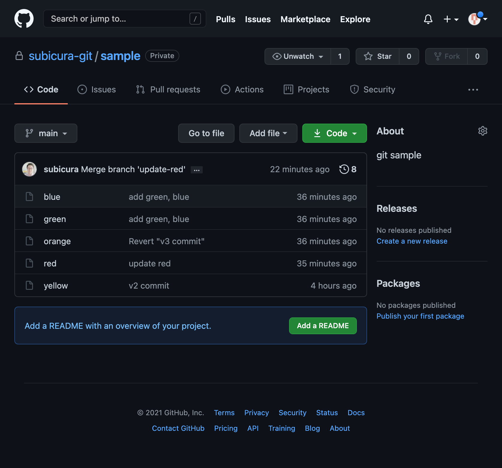
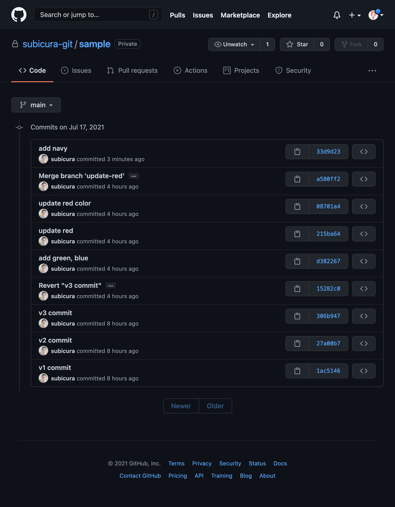
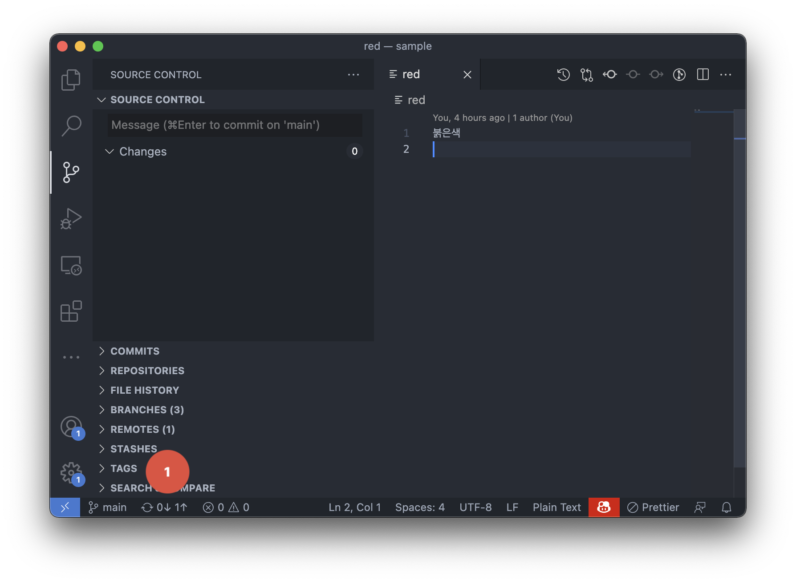
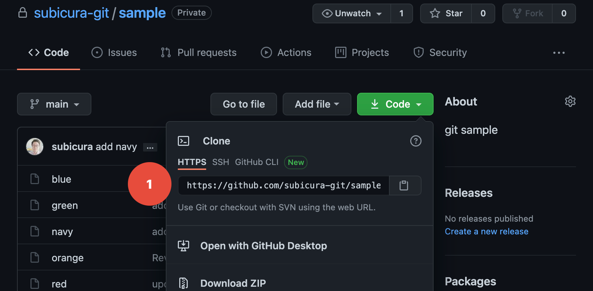
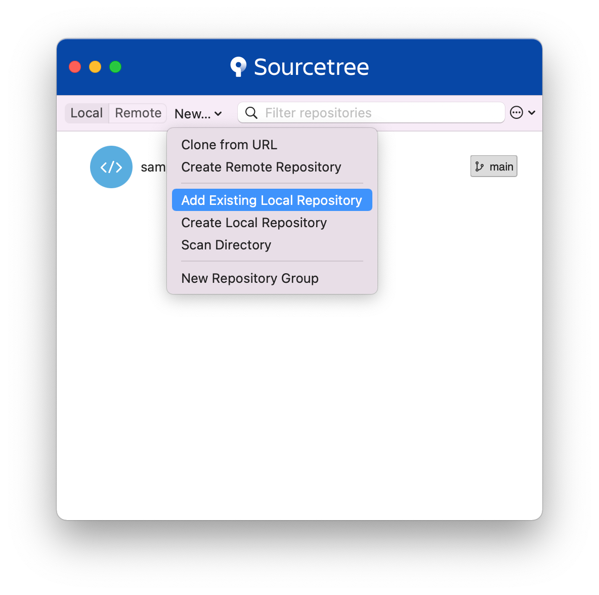
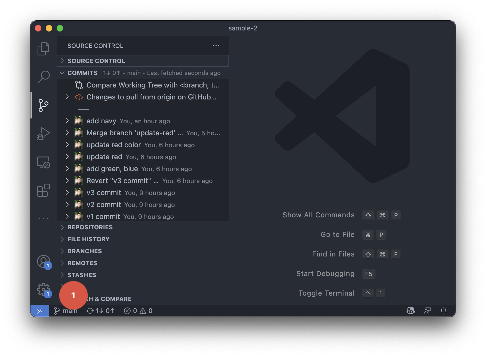
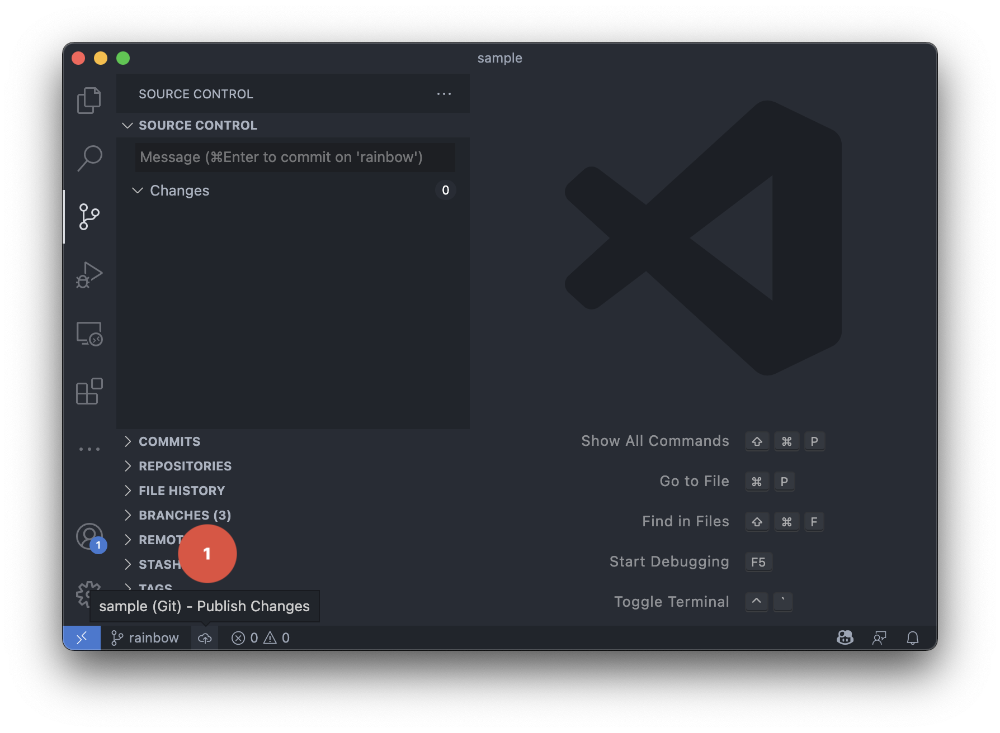
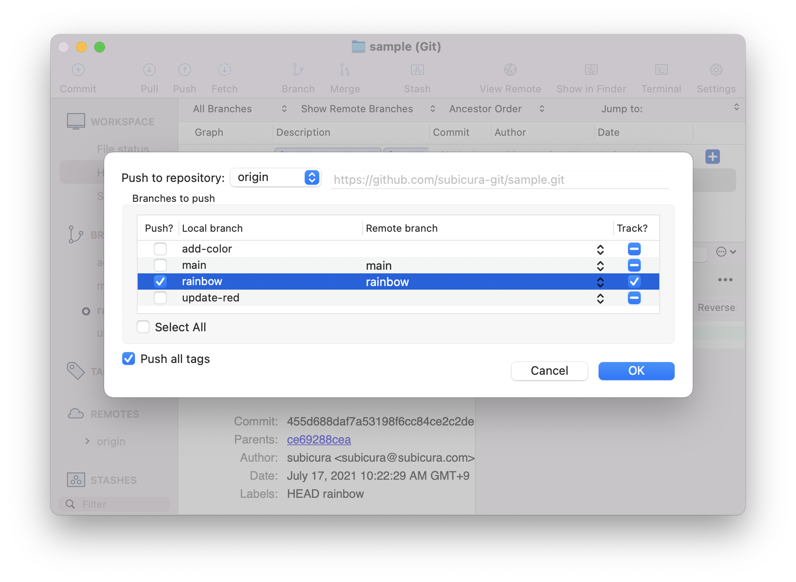

# GitHub Flow

::: tip ⚡️ 목표
GitHub을 이용하여 원격 저장소와 연동하고, GitHub Flow를 이용한 협업 방식을 배웁니다.
:::

GitHub은 Git의 원격 저장소를 제공하는 웹서비스입니다. 단순 저장소의 역할만 하는 것이 아니라, 협업에 필요한 이슈 관리, 코드리뷰 등 다양한 기능을 포함하여 개발자에게 인기가 많습니다. 다양한 오픈소스가 GitHub에 공개되어 있고 전세계 수많은 개발자가 매일 사용하고 있습니다. ~~GitHub 에러 == 개발자 쉬는 날~~

## GitHub 원격 저장소 생성

[GitHub 회원가입](../prepare/github-setup) 후 나만의 저장소를 생성합니다.

<div class="image-600">


</div>

로그인 후 `Create Repository`를 선택합니다.

<div class="image-600">


</div>

저장소 이름과 소개<sub>Description</sub>를 입력하고 권한을 `Private(비공개)`으로 변경한 후 `Create repository` 버튼을 클릭합니다.

<div class="image-600">


</div>

짠, 나만의 **원격 저장소**가 생성되었습니다! 🎉

## git push - 원격 저장소 저장

<usage text="git remote add <name> <url>" />
<usage text="git push [-u | --set-upstream] [<repository> [<refspec>…​]]" />

앞에서 실습했던 로컬 저장소를 GitHub에 푸시합니다. 로컬 저장소의 커밋 목록이 그대로 복제됩니다.

친절하게 저장소 메인 페이지에 적어놓은 명령어를 보고 따라합니다.

### 작업

1. `main` 브랜치에 `원격 저장소`(GitHub)를 `origin`(기본)으로 설정합니다.
2. 메인 브랜치를 `main`으로 설정합니다. (이미 `main`이므로 생략 가능)
3. 설정한 `원격 저장소`에 `로컬 저장소`의 모든 커밋을 `푸시`합니다. `-u` 옵션을 이용하여 이후에 푸시할 땐 별다른 원격 저장소 이름을 지정하지 않고 `git push`를 사용할 수 있습니다.

:::tip origin
Git은 여러개의 원격 저장소를 등록할 수 있고 기본 저장소의 이름이 `origin`입니다. GitHub을 메인 원격 저장소(origin)로 사용하고 Google Cloud에 추가로 원격 저장소 설정을 한다면 `google`이라는 이름을 사용할 수 있습니다.
:::

### 실습

```sh{1,3}
git remote add origin https://github.com/subicura-git/sample.git
git branch -M main
git push -u origin main # gp -u origin main
```

**결과**

```sh
Username for 'https://github.com':
Password for 'https://subicura-git@github.com':
Enumerating objects: 24, done.
Counting objects: 100% (24/24), done.
Delta compression using up to 8 threads
Compressing objects: 100% (15/15), done.
Writing objects: 100% (24/24), 1.82 KiB | 1.82 MiB/s, done.
Total 24 (delta 5), reused 0 (delta 0), pack-reused 0
remote: Resolving deltas: 100% (5/5), done.
To https://github.com/subicura-git/sample.git
 * [new branch]      main -> main
Branch 'main' set up to track remote branch 'main' from 'origin'.
```

GitHub 저장소의 접근권한이 제한되어 있어 아이디, 패스워드를 입력하라고 합니다. 아이디, 패스워드를 입력하면 정상적으로 푸시가 완료됩니다.

:::warning https vs ssh
원격 저장소의 주소를 설정할 때, https와 ssh를 선택할 수 있습니다. https는 아이디/패스워드 방식을 사용하고 ssh는 개인키와 공개키를 이용합니다. 이번 실습에선 https 방식을 이용합니다.
:::

푸시 후 GitHub 페이지를 새로고침 합니다.

<div class="image-600">



</div>

로컬 저장소에서 작업한 내용이 똑같이 보이는 것을 확인할 수 있습니다. 여러가지 메뉴를 눌러보면 CLI로 확인했던 사항을 웹으로 볼 수 있습니다.

이제 로컬 디렉토리를 지워도 원격에 동일한 저장소가 있기 때문에 언제든지 복구할 수 있습니다.

## Navy 파일 Push

최초 연결 후, `navy` 파일을 만들고 `Push`해 보겠습니다. 이전과 동일하게 로컬 저장소에서 커밋을 마치면 마지막으로 원격 저장소로 `Push`합니다. 추가 브랜치를 만들지 않고 `main`에서 진행합니다.

### CLI

```sh{3,4,5}
touch navy
echo "네이비" >> navy
git add -A # gaa
git commit -m "add navy" # gc -m "add navy"
git push # gp
```

**확인**

```sh
Enumerating objects: 4, done.
Counting objects: 100% (4/4), done.
Delta compression using up to 8 threads
Compressing objects: 100% (2/2), done.
Writing objects: 100% (3/3), 264 bytes | 264.00 KiB/s, done.
Total 3 (delta 1), reused 0 (delta 0), pack-reused 0
remote: Resolving deltas: 100% (1/1), completed with 1 local object.
To https://github.com/subicura-git/sample.git
   a580ff2..33d9d23  main -> main
```

- GitHub에서 확인

<div style="text-align: center; margin-top: 15px">
  
</div>

- 이력과 파일이 추가된 것을 확인

<div style="text-align: center; margin-top: 15px">
  
</div>

- 이력 확인

<div style="text-align: center; margin-top: 15px">
  
</div>

- 변경사항 확인

### Visual Studio Code



- `Push`할 내역이 하나 있다는 걸 확인할 수 있고 클릭하면 `Push`

### Sourcetree


- `Push`할 내역이 하나 있다는 걸 확인


- 로컬 저장소와 원격 저장소 연결 상태를 보여주고 `Push`

## git clone - 원격 저장소 복제

로컬 저장소에서 원격 저장소로 업로드하는 것을 봤고 이제 거꾸로 원격 저장소의 변경 사항을 로컬로 가져오는 것을 봅니다. 우선 기존 디렉토리를 그대로 두고 다른 디렉토리에 원격 저장소를 복제<sub>clone</sub>하겠습니다.

원격 저장소의 주소는 `GitHub` 저장소에서 확인할 수 있습니다.

<div style="text-align: center; margin-top: 15px">
  
</div>

### CLI

```
cd ..
git clone https://github.com/subicura-git/sample.git sample-2
```

**확인**

```sh
Cloning into 'sample-2'...
remote: Enumerating objects: 27, done.
remote: Counting objects: 100% (27/27), done.
remote: Compressing objects: 100% (11/11), done.
remote: Total 27 (delta 6), reused 27 (delta 6), pack-reused 0
Receiving objects: 100% (27/27), done.
Resolving deltas: 100% (6/6), done.
```

- `clone` 2번째 인자로 지정한 디렉토리에 원격 저장소의 내용을 복제
- 로컬에 `sample` 디렉토리와 `sample-2` 디렉토리는 동일한 원격 저장소를 바라봄

### Visual Studio Code

- `git clone` 후 Visual Studio Code로 열기

### Sourcetree

- `git clone` 후 Sourcetree로 열기 (open)

<div style="text-align: center; margin-top: 15px">
  
</div>

## Purple 파일 Push

기존 `sample` 디렉토리에서 `purple` 파일을 만들고 `Push`해 보겠습니다.

### CLI

```sh{3,4,5}
touch purple
echo "보라" >> purple
git add -A # gaa
git commit -m "add purple" # gc -m "add purple"
git push # gp
```

**확인**

```sh
[main cdce49d] add purple
 1 file changed, 1 insertion(+)
 create mode 100644 purple
Enumerating objects: 4, done.
Counting objects: 100% (4/4), done.
Delta compression using up to 8 threads
Compressing objects: 100% (2/2), done.
Writing objects: 100% (3/3), 262 bytes | 262.00 KiB/s, done.
Total 3 (delta 1), reused 0 (delta 0), pack-reused 0
remote: Resolving deltas: 100% (1/1), completed with 1 local object.
To https://github.com/subicura-git/sample.git
   33d9d23..cdce49d  main -> main
```

- `sample` 로컬 저장소와 GitHub 저장소는 `purple`이 추가되어 있고, `sample-2` 저장소는 아직 추가되지 않은 상태

### Visual Studio Code / Sourcetree

::: tip 실습
`purple` 파일을 추가하고 커밋 후, Push까지 해보세요.
:::

## git pull - 원격 저장소 내용 가져오기

원격 저장소에 업데이트 된 내용을 로컬 저장소로 가져옵니다. `sample-2` 디렉토리에서 작업합니다.

### CLI

```sh{1}
git pull # gl
```

**확인**

```sh
Updating 33d9d23..cdce49d
Fast-forward
 purple | 1 +
 1 file changed, 1 insertion(+)
 create mode 100644 purple
```

- 로컬 저장소에 purple 파일이 생긴것을 확인

### Visual Studio Code



- 원격저장소에서 한개의 커밋을 받을 준비가 되어있다는것을 표시

### Sourcetree


- 원격저장소에서 한개의 커밋을 받을 준비가 되어있다는것을 표시

:::tip Git Pull은 주기적으로
원격 저장소와 로컬 저장소의 차이가 커지면 나중에 충돌이 많이 발생하기 때문에 Git Pull은 자주 수행하는 것이 좋습니다.
:::

## GUI 도구 사용하기

### Visual Studio Code


- 원격 저장소 설정이 되면, 하단 브랜치명 오른쪽에 `싱크` 버튼이 추가됨
- 저 버튼으로 로컬과 원격 소스를 동기화할 수 있음

### Sourcetree


- GitHub 아이디/패스워드를 묻고 Remotes 설정이 보임
- 이제 상단의 `Push`와 `Pull` 버튼을 사용할 수 있음

## GitHub Flow

[GitHub Flow](https://guides.github.com/introduction/flow/)는 GitHub에서 제안하는 프로젝트 관리방법입니다. 브랜치와 `Pull Request`(줄여서 PR)라는 개념을 사용합니다.


다음과 같이 진행하겠습니다.

1. `rainbow` 브랜치를 만든다.
2. rainbow 파일을 추가하고 커밋을 한다.
3. `rainbow` 브랜치를 원격 저장소에 `Push`한다.
4. GitHub에서 푸시 된 `rainbow` 브랜치를 `Pull Request`한다.
5. GitHub에서 코드리뷰를 한다.
6. GitHub에서 `Merge`한다.
7. 로컬 저장소에서 원격 저장소에 머지된 내용을 `Pull`한다.
8. 완료! 🎉

### CLI

```sh
git switch -c rainbow # gsw -c rainbow
touch rainbow
echo "this is rainbow" >> rainbow
git add -A # gaa
git commit -m "add rainbow" # gc -m "rainbow"
git push origin rainbow # gp origin rainbow
```

**설명**

- `git push origin rainbow`: 현재 브랜치를 원격 저장소의 `rainbow` 브랜치로 업로드

**확인**

```sh
Enumerating objects: 7, done.
Counting objects: 100% (7/7), done.
Delta compression using up to 8 threads
Compressing objects: 100% (4/4), done.
Writing objects: 100% (6/6), 493 bytes | 493.00 KiB/s, done.
Total 6 (delta 2), reused 0 (delta 0), pack-reused 0
remote: Resolving deltas: 100% (2/2), completed with 1 local object.
remote:
remote: Create a pull request for 'rainbow' on GitHub by visiting:
remote:      https://github.com/subicura-git/sample/pull/new/rainbow
remote:
To https://github.com/subicura-git/sample.git
 * [new branch]      rainbow -> rainbow
```

로그를 보면 친절하게 `https://github.com/subicura-git/sample/pull/new/rainbow` `Pull Request`용 URL을 알려줍니다. 저 링크를 눌러도 되고 GitHub 저장소에 접속하면 다음과 같은 화면을 볼 수 있습니다.

<div style="text-align: center; margin-top: 15px">
  
</div>

- `Pull Request` 생성 버튼 클릭

<div style="text-align: center; margin-top: 15px">
  
</div>

- 작업 내용을 간략하게 적고, 어떤 작업이 있었는지 확인 후 `Create Pull request` 클릭

<div style="text-align: center; margin-top: 15px">
  
</div>

짜잔! 드디어 첫번째 PR이 열렸습니다. 협업의 길에 오신것을 환영합니다. 🎉

여기서 코드 리뷰를 진행하고 리뷰에 따라 코드를 수정하고 다시 `Push`하는 작업을 반복합니다. 다른 개발자에게 리뷰를 받고 도움을 주면서 코드를 이해하고 더 좋은 코드를 작성할 수 있습니다.

최종 리뷰가 완료되면 `Merge pull request` 버튼을 누릅니다.

아직 로컬 저장소는 GitHub에서 머지된 내역이 보이지 않으므로 원격 저장소의 내용을 가져옵니다.

```sh{1,2}
git switch main # gsw main
git pull
```

**확인**

```sh
Switched to branch 'main'
Your branch is behind 'origin/main' by 3 commits, and can be fast-forwarded.
  (use "git pull" to update your local branch)
Updating cdce49d..4f82236
Fast-forward
 rainbow | 1 +
 1 file changed, 1 insertion(+)
 create mode 100644 rainbow
```

최종 협업이 완료되었습니다. 👍

### Visual Studio Code

대부분의 작업은 기존에 했던 작업이고, 새로운 로컬 브랜치를 원격에 `Push`하는 작업을 확인합니다.



- 하단 브랜치명 오른쪽 `Push` 클릭

### Sourcetree

대부분의 작업은 기존에 했던 작업이고, 새로운 로컬 브랜치를 원격에 `Push`하는 작업을 확인합니다.



- `Push`를 선택하고 원격에 적용하고 싶은 브랜치를 체크한다음 `OK` 버튼 클릭
