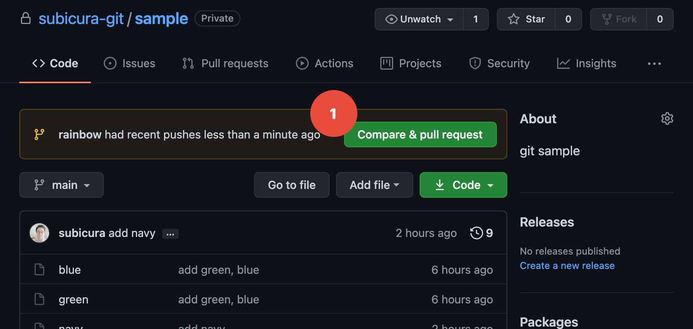

# GitHub Flow

::: tip ⚡️ 목표
GitHub Flow를 이용한 협업 방식을 배웁니다.
:::

GitHub에서 제공하는 `Pull Request`와 `코드 리뷰`기능을 적극적으로 활용한 `GitHub Flow`방식을 알아보겠습니다.

## GitHub Flow 방식

[GitHub Flow](https://guides.github.com/introduction/flow/)는 GitHub에서 제안하는 프로젝트 관리방법입니다. 브랜치와 `Pull Request`(줄여서 PR)라는 개념을 사용합니다.


다음과 같이 진행합니다.

1. `rainbow` 브랜치를 만든다.
2. rainbow 파일을 추가하고 커밋을 한다.
3. `rainbow` 브랜치를 원격 저장소에 `Push`한다.
4. GitHub에서 푸시 된 `rainbow` 브랜치를 `Pull Request`한다.
5. GitHub에서 코드리뷰를 한다.
6. GitHub에서 `Merge`한다.
7. 로컬 저장소에서 원격 저장소에 머지된 내용을 `Pull`한다.
8. 완료! 🎉

**실습**

```sh{6}
git switch -c rainbow # gsw -c rainbow
touch rainbow
echo "this is rainbow" >> rainbow
git add -A # gaa
git commit -m "add rainbow" # gc -m "rainbow"
git push origin rainbow # gp origin rainbow
```

:::tip Remote Branch
로컬 브랜치를 모두 원격 브랜치로 연동할 필요는 없습니다. 보통 로컬 브랜치에서 작업을 하다가 의미가 있다고 판단이 될 때 원격 저장소로 푸시하게 됩니다.
:::

**확인**

```sh
Enumerating objects: 7, done.
Counting objects: 100% (7/7), done.
Delta compression using up to 8 threads
Compressing objects: 100% (4/4), done.
Writing objects: 100% (6/6), 493 bytes | 493.00 KiB/s, done.
Total 6 (delta 2), reused 0 (delta 0), pack-reused 0
remote: Resolving deltas: 100% (2/2), completed with 1 local object.
remote:
remote: Create a pull request for 'rainbow' on GitHub by visiting:
remote:      https://github.com/subicura-git/sample/pull/new/rainbow
remote:
To https://github.com/subicura-git/sample.git
 * [new branch]      rainbow -> rainbow
```

로그를 보면 친절하게 `https://github.com/subicura-git/sample/pull/new/rainbow` `Pull Request`용 URL을 알려줍니다. 저 링크를 눌러도 되고 GitHub 저장소에 접속하면 다음과 같은 화면을 볼 수 있습니다.

<div class="image-600">



</div>

원격 브랜치가 생성되면 자동으로 `Compare & pull request` 버튼이 보입니다.

<div class="image-600">


</div>

작업 내용을 간략하게 적고, 어떤 작업이 있었는지 변경내용을 확인 후 `Create Pull request` 버튼을 클릭합니다.

<div class="image-600">


</div>

짜잔! 드디어 첫 번째 PR이 열렸습니다. 🎉

이제 코드 리뷰를 진행(이거이거 이렇게 수정하는게 좋겠는데요? 라고 댓글을 답니다)하고 리뷰에 따라 코드를 수정하고 다시 `Push`하는 작업을 반복합니다. 다른 개발자와 코드리뷰를 하면서 소스코드를 더 자세히 이해하고 더 좋은 코드를 작성할 수 있습니다.

최종 리뷰가 완료되면 `Merge pull request` 버튼을 누릅니다. 원격 저장소에서 해당 브랜치의 변경사항이 `main`브랜치에 머지됩니다.

아직 로컬 저장소는 GitHub에 머지된 내역이 보이지 않으므로 원격 저장소의 내용을 가져옵니다.

**실습**

```sh
git switch main # gsw main
git pull # gl
```

**확인**

```sh
Switched to branch 'main'
Your branch is behind 'origin/main' by 3 commits, and can be fast-forwarded.
  (use "git pull" to update your local branch)
Updating cdce49d..4f82236
Fast-forward
 rainbow | 1 +
 1 file changed, 1 insertion(+)
 create mode 100644 rainbow
```

최종 머지가 완료되었습니다. 👍

## GUI 도구 사용하기

지금까지 작업을 Visual Studio Code와 Sourcetree로 해보고 어떤 장점이 있는지 확인해 보겠습니다.

CLI로 로컬 브랜치를 원격 저장소에 푸시할 때 `git push origin [branch name]`을 입력했는데 이 명령어를 더 쉽게 사용해 보겠습니다.

### Visual Studio Code


하단 브랜치명 오른쪽에 `Push` 아이콘을 클릭하면 현재 브랜치가 원격 저장소로 푸시 됩니다. 끝!

### Sourcetree


- `Push`를 선택하고 원격에 적용하고 싶은 브랜치를 체크한 다음 `OK` 버튼을 클릭합니다. 끝!

## 그래서

Git은 브랜치 기능을 제공하고 브랜치를 어떤식으로 사용할지는 개발자 마음입니다. GitHub Flow외에 [Git Flow](https://nvie.com/posts/a-successful-git-branching-model/)나 [GitLab Flow](https://docs.gitlab.com/ee/topics/gitlab_flow.html)가 있는데, 프로젝트나 팀의 상황에 맞게 적절한 방법을 선택하면 됩니다. GitHub Flow는 직관적이고 가볍기 때문에 널리 사용되고 있습니다.
