# GitHub 공유

::: tip ⚡️ 목표
GitHub을 이용하여 원격 저장소와 연동하는 방법을 알아봅니다.
:::

GitHub은 Git의 원격 저장소를 제공하는 웹서비스입니다. 단순 저장소의 역할만 하는 것이 아니라, 협업에 필요한 이슈 관리, 코드리뷰 등 다양한 기능을 포함합니다. 다양한 오픈소스가 GitHub에 공개되어 있고 전 세계 수많은 개발자가 매일 사용하고 있습니다. ~~GitHub 에러 == 개발자 쉬는 날~~

## GitHub 원격 저장소 생성

[GitHub 회원가입](../prepare/github-setup) 후 나만의 저장소를 생성합니다.

<div class="image-600">

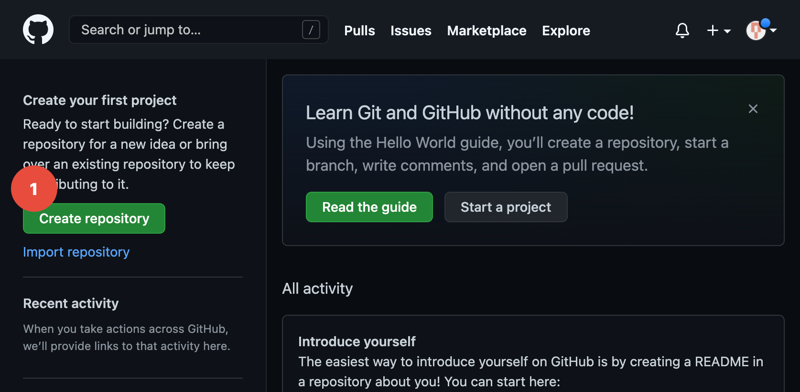

</div>

로그인 후 `Create Repository`를 선택합니다.

<div class="image-600">

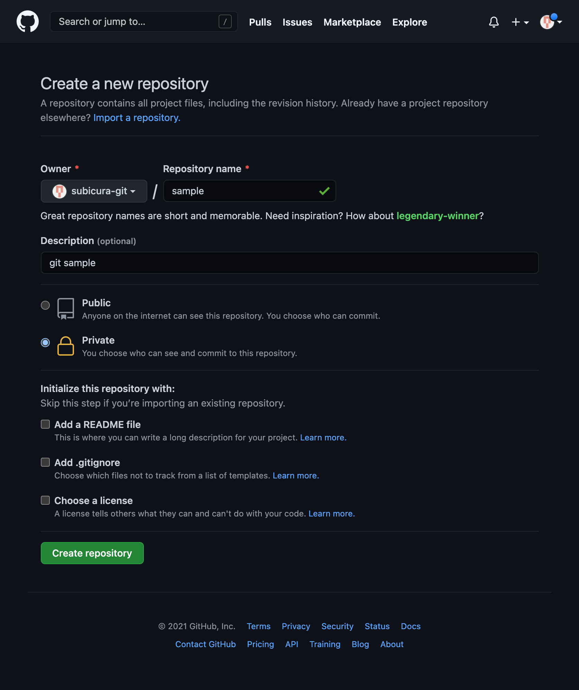

</div>

저장소 이름과 소개<sub>Description</sub>를 입력하고 권한을 `Private(비공개)`으로 변경한 후 `Create repository` 버튼을 클릭합니다.

<div class="image-600">

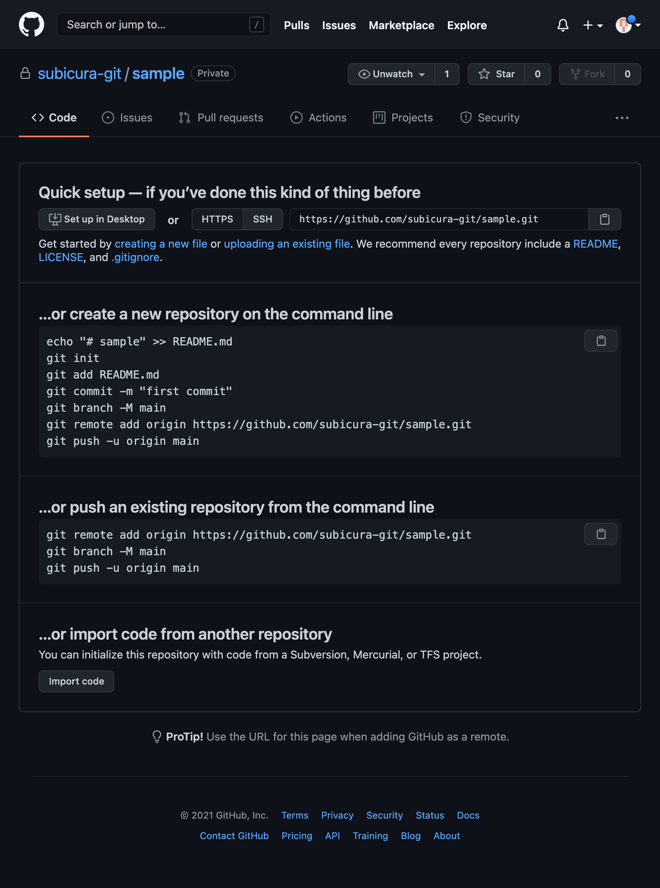

</div>

짠, 나만의 **원격 저장소**가 생성되었습니다! 🎉

## git push - 원격 저장소 저장

<usage text="git remote add <name> <url>" />
<usage text="git push [-u | --set-upstream] [<repository> [<refspec>…​]]" />

앞에서 실습했던 로컬 저장소를 GitHub에 푸시합니다. 로컬 저장소의 커밋 목록이 그대로 복제될 예정입니다.

친절하게도 저장소 메인 페이지에 푸시하는 방법이 적혀있습니다. 따라해 봅시다~

**작업**

1. `main` 브랜치에 `원격 저장소`(GitHub)를 `origin`(기본)으로 설정합니다.
2. 메인 브랜치를 `main`으로 설정합니다. (이미 `main`이므로 생략 가능)
3. 설정한 `원격 저장소`에 `로컬 저장소`의 모든 커밋을 `푸시`합니다. `-u` 옵션을 이용하여 이후에 푸시할 땐 별다른 원격 저장소 이름을 지정하지 않고 `git push`를 사용할 수 있습니다.

:::tip origin
Git은 여러 개의 원격 저장소를 등록할 수 있고 기본 저장소의 이름이 `origin`입니다. GitHub을 메인 원격 저장소(origin)로 사용하고 Google Cloud에 추가로 원격 저장소 설정을 한다면 `google`이라는 이름을 사용할 수 있습니다.
:::

**실습**

```sh{1,3}
git remote add origin https://github.com/subicura-git/sample.git
git branch -M main
git push -u origin main # gp -u origin main
```

**결과**

```sh
Username for 'https://github.com':
Password for 'https://subicura-git@github.com':
Enumerating objects: 24, done.
Counting objects: 100% (24/24), done.
Delta compression using up to 8 threads
Compressing objects: 100% (15/15), done.
Writing objects: 100% (24/24), 1.82 KiB | 1.82 MiB/s, done.
Total 24 (delta 5), reused 0 (delta 0), pack-reused 0
remote: Resolving deltas: 100% (5/5), done.
To https://github.com/subicura-git/sample.git
 * [new branch]      main -> main
Branch 'main' set up to track remote branch 'main' from 'origin'.
```

GitHub 저장소의 접근권한이 제한되어 있어 아이디, 패스워드를 입력하라고 합니다. 아이디, 패스워드를 입력하면 정상적으로 푸시가 완료됩니다.

:::warning https vs ssh
원격 저장소의 주소를 설정할 때, https와 ssh를 선택할 수 있습니다. https는 아이디/패스워드 방식을 사용하고 ssh는 개인키와 공개키를 이용합니다. 이번 실습에선 https 방식을 이용합니다.
:::

푸시 후 GitHub 페이지를 새로고침 합니다.

<div class="image-600">

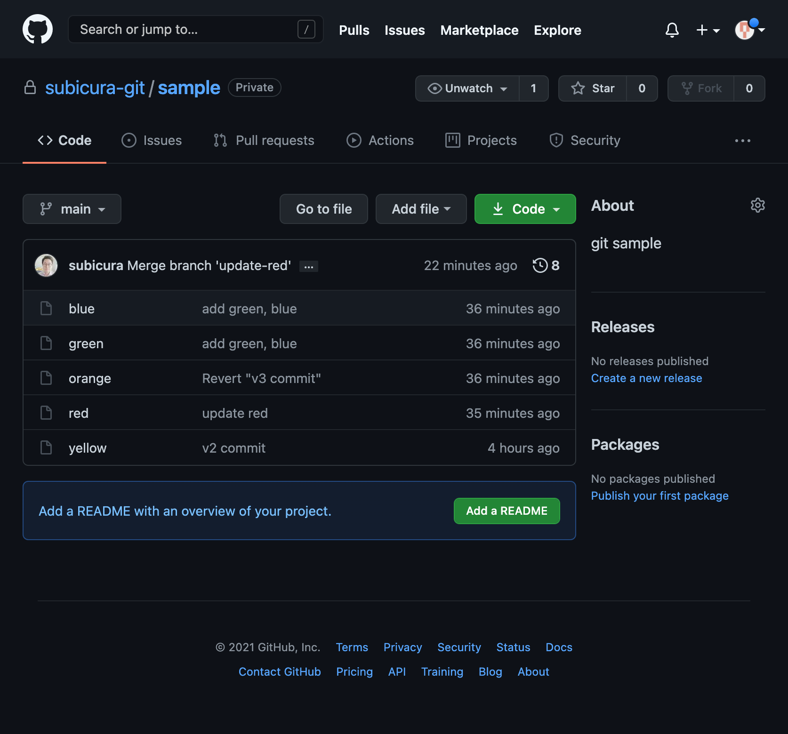

</div>

로컬 저장소에서 작업한 내용이 똑같이 보이는 것을 확인할 수 있습니다. 여러 가지 메뉴를 눌러보면 CLI로 확인했던 사항을 웹으로 볼 수 있습니다.

이제 로컬 디렉토리를 지워도 원격에 동일한 저장소가 있기 때문에 언제든지 복구할 수 있습니다.

## 새 커밋 Push

원격 저장소 연결 후, 로컬에서 `navy` 파일을 만들고 `Push`해 보겠습니다.

**작업**

1. `navy` 파일 추가
2. 전체 파일 인덱스에 추가
3. 새 커밋 작성
4. 원격 저장소에 푸시

**실습**

```sh
touch navy
echo "네이비" >> navy
git add -A # gaa
git commit -m "add navy" # gc -m "add navy"
git push # gp
```

**확인**

```sh
Enumerating objects: 4, done.
Counting objects: 100% (4/4), done.
Delta compression using up to 8 threads
Compressing objects: 100% (2/2), done.
Writing objects: 100% (3/3), 264 bytes | 264.00 KiB/s, done.
Total 3 (delta 1), reused 0 (delta 0), pack-reused 0
remote: Resolving deltas: 100% (1/1), completed with 1 local object.
To https://github.com/subicura-git/sample.git
   a580ff2..33d9d23  main -> main
```

이전에 했던 작업과 차이점은 마지막에 푸시를 한 것밖에 없습니다. Git은 로컬에서 대부분의 작업이 이루어지고 원격 저장소와 연동이 필요하다고 생각할 때 추가적인 작업을 하면 됩니다.

푸시 후 GitHub 페이지를 새로고침 합니다.

<div class="image-600">

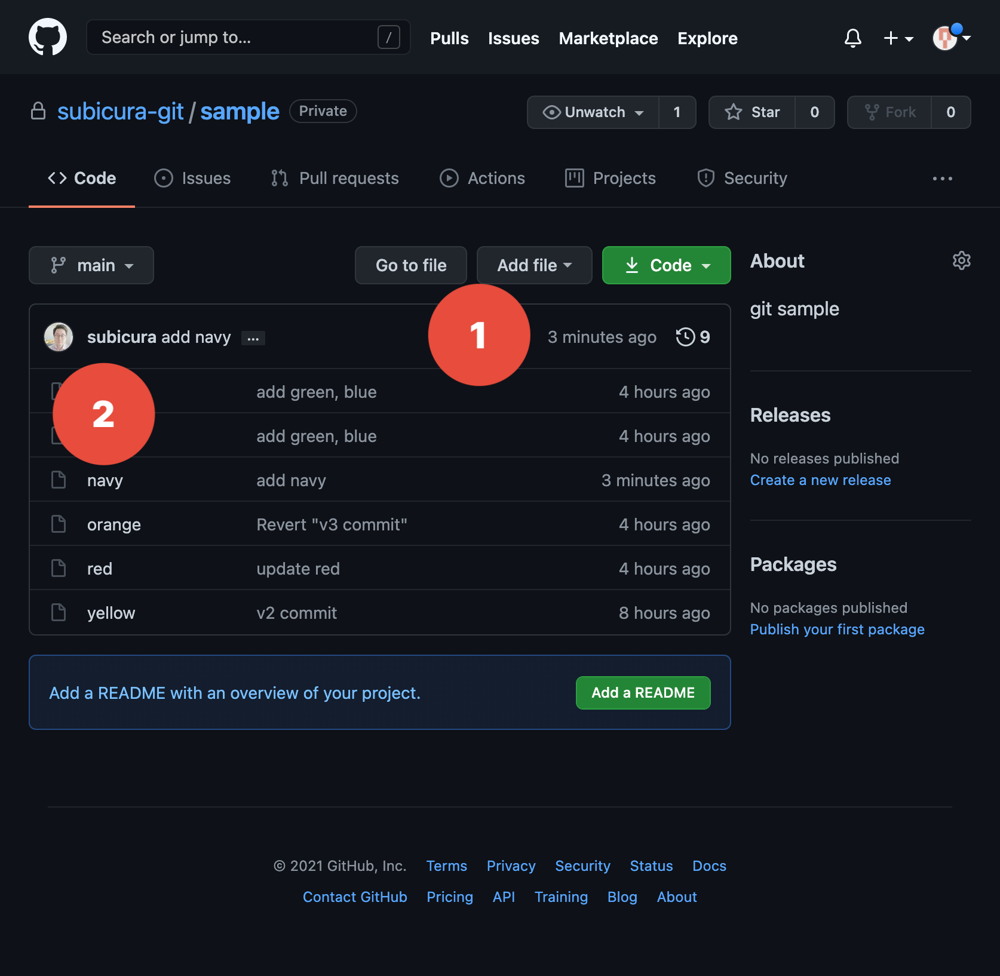

</div>

로컬 저장소에서 작업한 새로운 커밋과 파일이 추가된 것을 확인할 수 있습니다.

<div class="image-600">

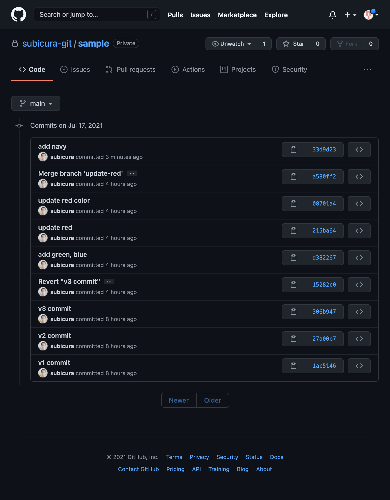

</div>

이력도 정상적으로 확인됩니다.

<div class="image-600">

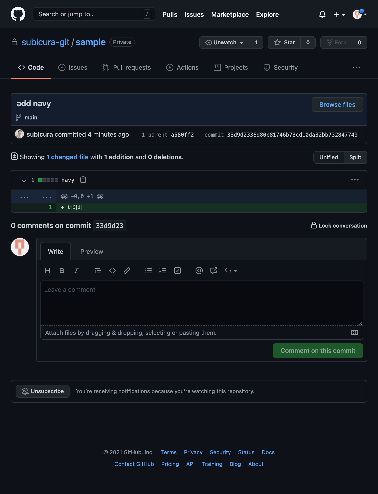

</div>

커밋 변경사항도 확인할 수 있습니다.

## git clone - 원격 저장소 복제

<usage text="git clone <repository> [<directory>]" />

지금까지 로컬 저장소를 먼저 만들고 원격 저장소에 연동했는데 거꾸로 원격 저장소를 로컬로 가져오는 것을 해봅니다. 우선 기존 `sample` 디렉토리를 그대로 두고 다른 디렉토리에 원격 저장소를 복제<sub>clone</sub>하겠습니다.

먼저 원격 저장소의 주소를 확인해야 합니다. `GitHub` 저장소에서 `Code`를 눌러 확인합니다.

<div class="image-600">

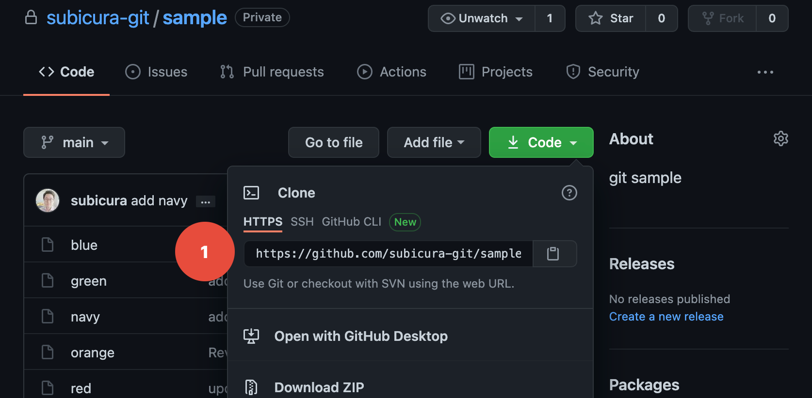

</div>

**작업**

1. 새로운 디렉토리를 생성하기 위해 상위 디렉토리로 이동
2. `sample-2` 디렉토리에 원격 저장소를 복제

**실습**

```sh{2}
cd ..
git clone https://github.com/subicura-git/sample.git sample-2
```

**확인**

```sh
Cloning into 'sample-2'...
remote: Enumerating objects: 27, done.
remote: Counting objects: 100% (27/27), done.
remote: Compressing objects: 100% (11/11), done.
remote: Total 27 (delta 6), reused 27 (delta 6), pack-reused 0
Receiving objects: 100% (27/27), done.
Resolving deltas: 100% (6/6), done.
```

`git clone` 2번째 인자로 지정한 디렉토리에 원격 저장소의 내용이 복제된 것을 확인할 수 있습니다.

:::tip git clone
두번째 인자를 비우면 원격 저장소의 이름을 그대로 사용합니다. 여기선 `sample`을 사용하는데 이미 존재하는 디렉토리이기 때문에 별도의 이름을 지정했습니다.
:::

## 추가 커밋 Push

현재 동일한 원격 저장소를 바라보는 두 개의 로컬 저장소가 있습니다. 하나의 저장소에서 변화를 주고 다른 저장소에서 변화를 동기화하는 작업을 해보겠습니다.

**작업**

1. `sample` 디렉토리로 이동 (여기서 작업하고 `sample-2`에서 확인할 예정)
2. `purple` 파일 추가
3. 전체 파일 인덱스에 추가
4. 새 커밋 작성
5. 원격 저장소에 푸시

**실습**

```sh
cd sample
touch purple
echo "보라" >> purple
git add -A # gaa
git commit -m "add purple" # gc -m "add purple"
git push # gp
```

**확인**

```sh
[main cdce49d] add purple
 1 file changed, 1 insertion(+)
 create mode 100644 purple
Enumerating objects: 4, done.
Counting objects: 100% (4/4), done.
Delta compression using up to 8 threads
Compressing objects: 100% (2/2), done.
Writing objects: 100% (3/3), 262 bytes | 262.00 KiB/s, done.
Total 3 (delta 1), reused 0 (delta 0), pack-reused 0
remote: Resolving deltas: 100% (1/1), completed with 1 local object.
To https://github.com/subicura-git/sample.git
   33d9d23..cdce49d  main -> main
```

`sample` 로컬 저장소와 GitHub 저장소는 `purple`이 추가되어 있고, `sample-2` 저장소는 아직 추가되지 않은 상태입니다.

## git pull - 원격 저장소 내용 가져오기

<usage text="git pull [<repository> [<refspec>…​]]" />

원격 저장소에 변경된 내용을 로컬 저장소로 가져옵니다. Git은 자동으로 원격 저장소와 로컬 저장소를 동기화하지 않습니다. 명시적으로 명령어를 입력해야 합니다.

**작업**

1. `sample-2` 디렉토리로 이동
2. 원격 저장소 풀 명령어 입력

**실습**

```sh{3}
cd ..
cd sample-2
git pull # gl
```

**확인**

```sh
Updating 33d9d23..cdce49d
Fast-forward
 purple | 1 +
 1 file changed, 1 insertion(+)
 create mode 100644 purple
```

`sample-2` 로컬 저장소에 purple 파일이 생긴 것을 확인할 수 있습니다.

:::tip Git Pull을 자주 하자
원격 저장소와 로컬 저장소의 차이가 커지면 나중에 충돌이 많이 발생하기 때문에 Git Pull은 자주 수행하는 것이 좋습니다.
:::

## GUI 도구 사용하기

지금까지 작업을 Visual Studio Code와 Sourcetree로 해보고 어떤 장점이 있는지 확인해 보겠습니다.

원격 저장소 연결은 GUI로 할 수도 있지만, 프로젝트를 설정할 때 처음 한 번 수행하면 되고 CLI 명령어를 복사/붙여넣기 하는 수준이기 때문에 CLI로 진행합니다.

GUI의 역할은 주기적으로 원격 저장소의 변경사항을 체크하여 변경된 사항이 있는지 표시해주고 클릭 한 번으로 푸시와 풀을 할 수 있습니다.

### Visual Studio Code

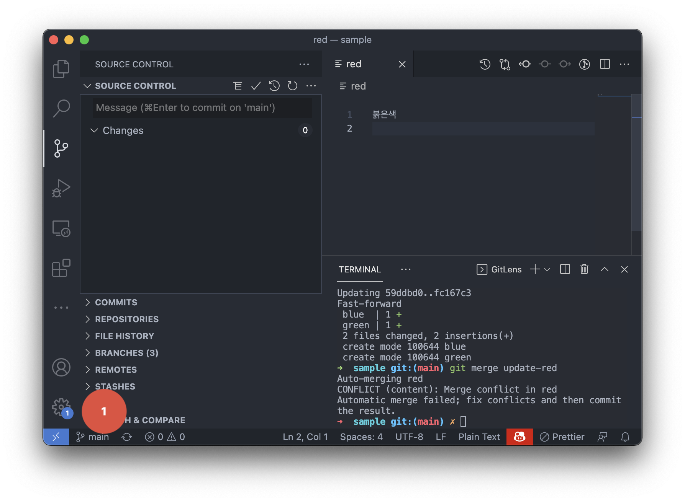

원격 저장소를 설정하면, 하단 브랜치명 오른쪽에 `싱크` 버튼이 추가됩니다. 이 버튼을 누르면 풀을 받고 푸시를 수행합니다. 필요할 때마다 한 번씩 누르면 됩니다.

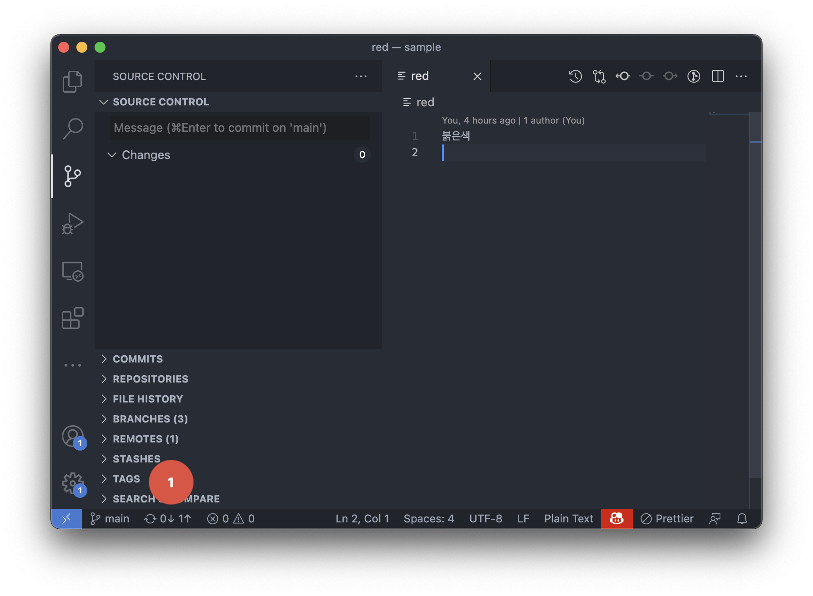

로컬 저장소만 수정하고 원격 저장소에 푸시하지 않은 내역이 있다면 친절하게 알려줍니다. 내역을 모았다가 푸시해도 되고 자주 푸시해도 좋습니다.

:::tip 모아서 푸시하기
한번 푸시한 커밋은 수정이 불가능합니다. 강제로 수정할 수 있지만, 다른 사용자가 풀을 받았다면 이력이 꼬이기 때문입니다.  
따라서, 로컬 저장소에서 여러개의 커밋을 생성했다면 푸시하기 전에 커밋을 작은 단위로 합치거나 메시지를 보기 좋게 수정하여 정리한 다음에 푸시하는 것이 좋습니다.
:::

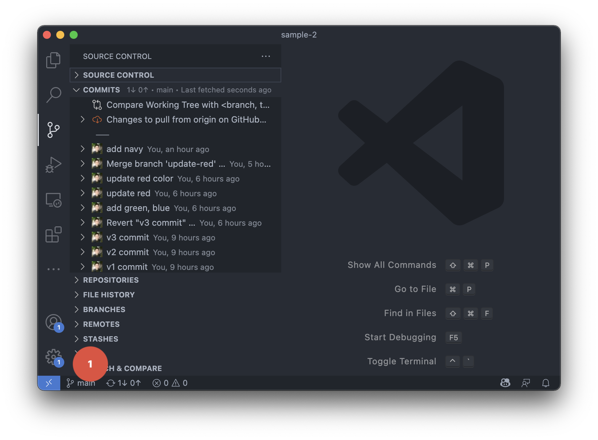

원격저장소에서 변경된 사항이 있으면 화면에서 표시됩니다. 클릭하면 풀 명령어를 실행합니다.

### Sourcetree

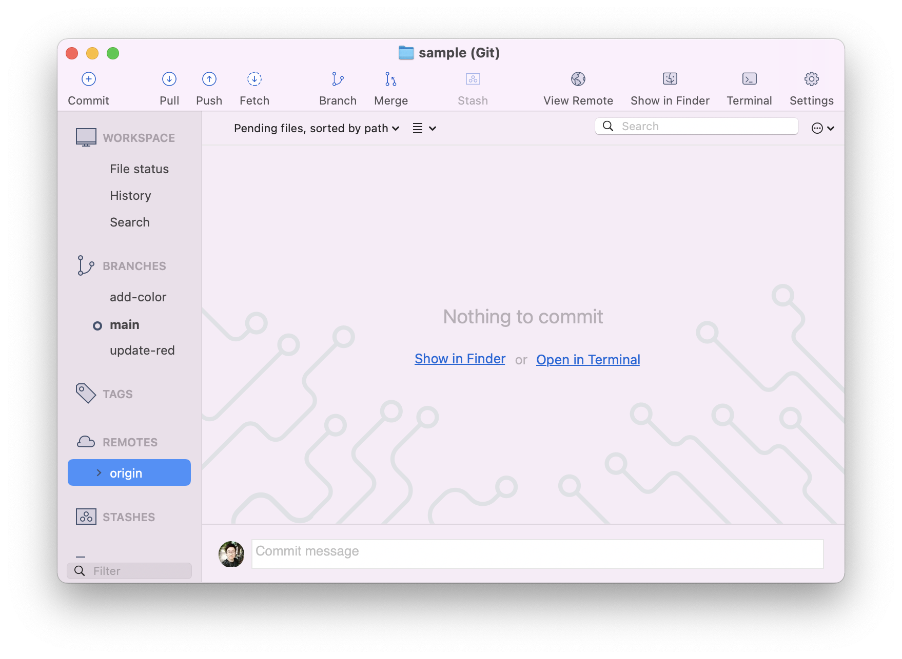

Sourcetree를 사용하면 GitHub 아이디/패스워드를 다시 물어봅니다. 정상적으로 입력하면 상단의 `Push`와 `Pull` 버튼을 사용할 수 있습니다.

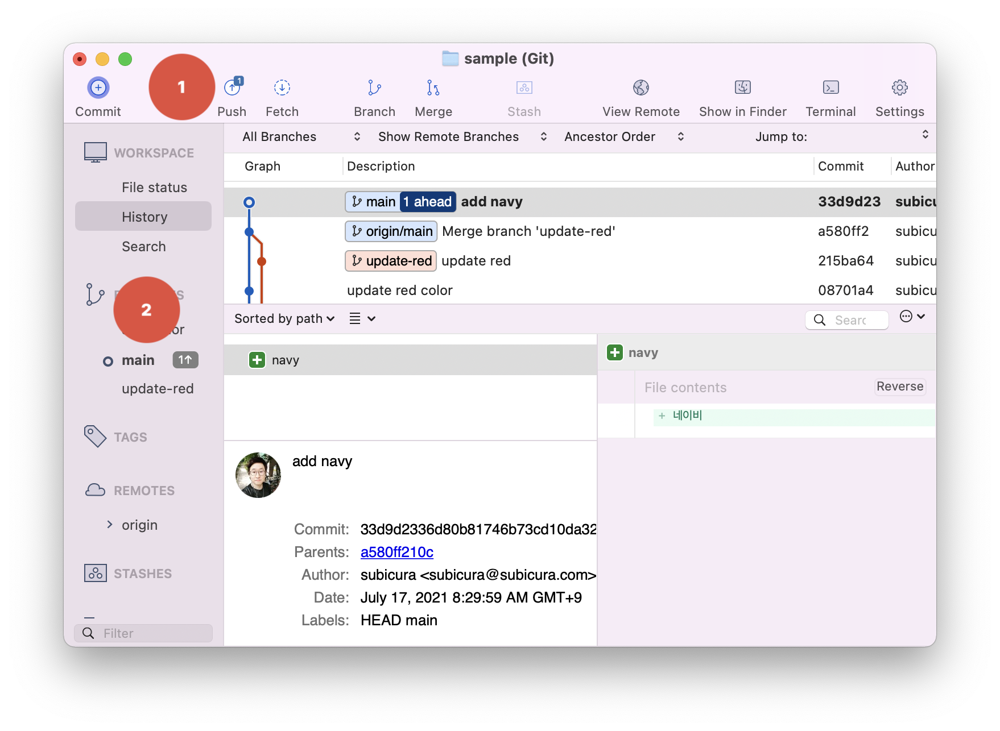

`Push`할 내역이 하나 있다는 걸 확인할 수 있습니다.

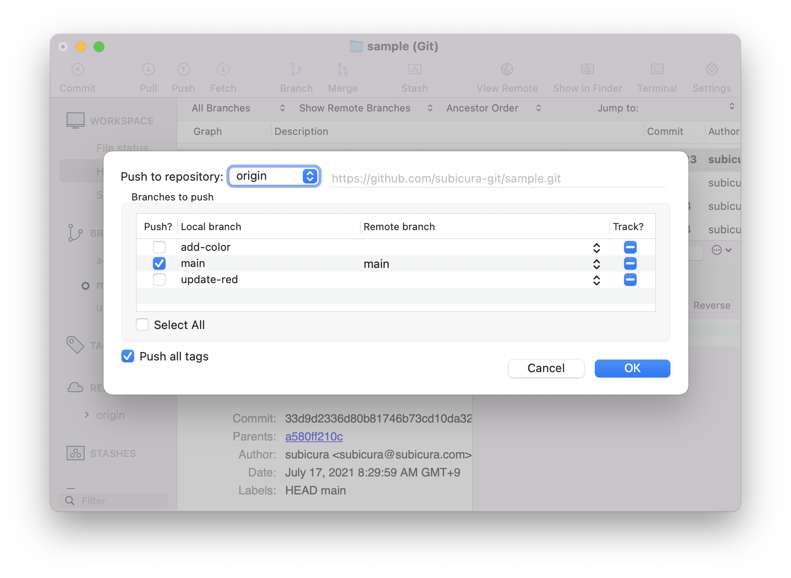

`Push` 버튼을 누르면 로컬 저장소와 원격 저장소 연결 상태를 보여주고 `OK` 버튼을 누르면 푸시됩니다.

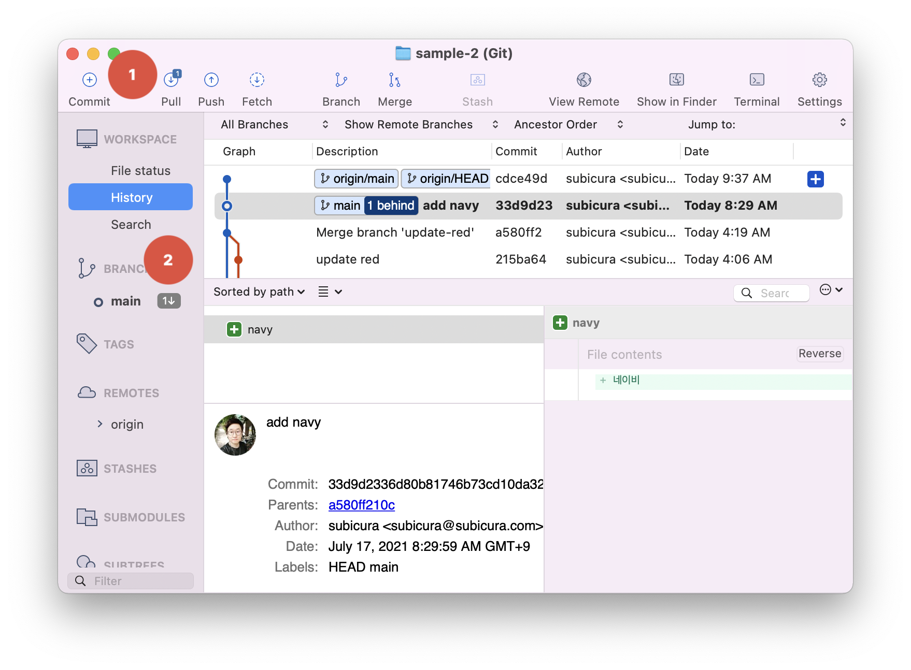

원격저장소에서 한 개의 커밋을 받을 준비가 되어있다는것도 표시됩니다.

## 그래서

지금까지 원격 저장소와 관련된 기본적인 기능을 알아보았습니다. 다른 버전 관리 시스템은 커밋하면 바로 원격 저장소에 반영되는데, Git은 로컬 저장소와 원격 저장소가 분리되었다는 걸 명확히 알 수 있습니다.  
조금 개념이 복잡해 보일 수 있지만, 익숙해지면 훨씬 더 편하게 느껴질 거에요.
