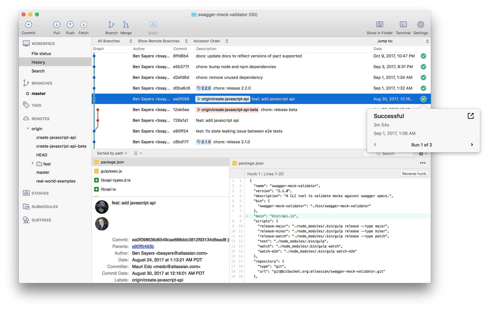

# 실습환경 준비

Git 프로그램과 생산성을 높여주는 다양한 도구를 설치합니다.

**필수**

- [Git 설치](./git-setup)
- [GitHub 가입](./github-setup)

**선택**

- [터미널 설정](./terminal-setup)
- [VSCode 설치](./vscode-setup)
- [SourceTree 설치](./sourcetree-setup)

## 필수 요소

Git은 가장 인기 있는 분산 버전 관리 시스템(DVCS)Distributed version control systems입니다. 터미널에서 사용하는 CLI 프로그램으로 한 땀 한 땀 명령어를 입력하여 버전을 관리합니다.

GitHub은 Git의 원격 저장소를 제공하는 웹서비스입니다. 단순 저장소의 역할만 하는 것이 아니라, 협업에 필요한 이슈 관리, 코드리뷰 등 다양한 기능을 포함하여 개발자에게 인기가 많습니다. 다양한 오픈소스가 GitHub에 공개되어 있고 전세계 수많은 개발자가 매일 사용하고 있습니다. ~~GitHub 에러 == 개발자 쉬는 날~~

## 선택 요소

Git 학습에 필수는 아니지만, 알아두면 생산성이 높아지는 도구들을 알아봅니다.

::: tip 생산성 높이기
도구를 잘 활용하여 하루 10분을 절약할 수 있다면, 1년에 3,650분 = 약 60시간을 절약할 수 있습니다. 😆 자주 사용하는 기능일수록 의식적으로 더 나은 방법을 찾고 효율을 높여봅시다.
:::

### 터미널 설정

  

Git 저장소의 상태를 터미널 프롬프트에서 바로 확인할 수 있습니다. 현재 사용 중인 브랜치명, 각종 파일 버전 상태, 원격 저장소 상태 등 다양한 정보를 손쉽게 볼 수 있습니다.

그리고 별칭alias(`git status` = `gst`, `git push` = `gp`, ...)과 자동완성 기능을 이용하면 타이핑 시간을 절약할 수 있습니다.

[터미널 설정하기](./terminal-setup)

### Visual Studio Code 설치

Visual Studio Code의 주기능은 코드 작성이지만, 버전 관리를 위한 기능이 기본으로 포함되어 있고 각종 플러그인을 추가하여 풍부한 기능을 사용할 수 있습니다.

에디터에 내장된 버전 관리 기능을 익힌다면, 에디터 - 터미널 - 에디터 - 터미널을 왔다 갔다 하지 않고 더 효율적으로 작업할 수 있습니다. 여기서는 가장 널리 사용되는 Visual Studio Code를 설명하지만, IntelliJ나 다른 도구들도 버전 관리 할 수 있는 방법을 비슷한 철학으로 제공하기 때문에 꼭 찾아보시기 바랍니다.

[VSCode 설치하기](./vscode-setup)

### SourceTree 설치

소스트리는 오로지 버전 관리에 특화된 애플리케이션입니다. CLI는 어렵고, 에디터에 내장된 기능이 부족하다면 전용 프로그램이 도움이 됩니다. 써보고 마음에 든다면 다른 유료 프로그램도 알아보세요.

[SourceTree 설치하기](./sourcetree-setup)
