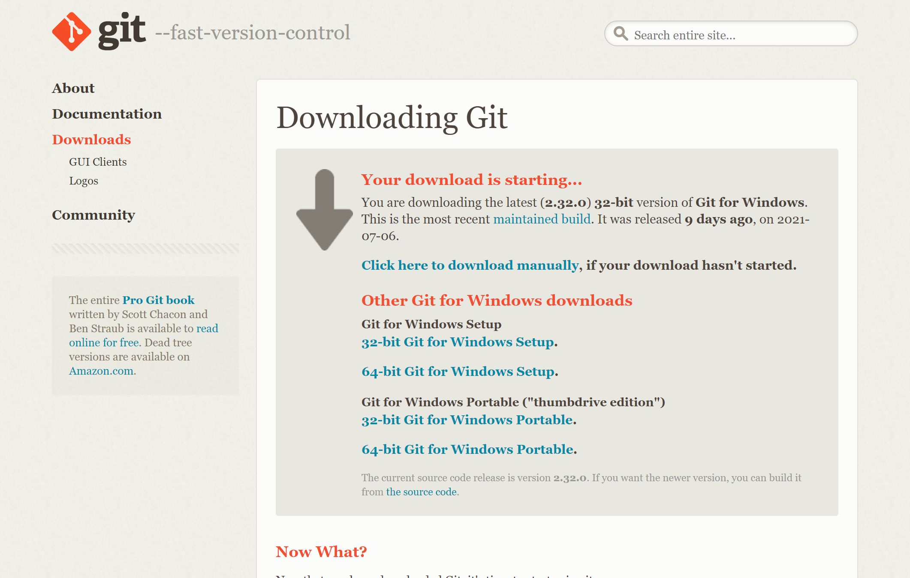
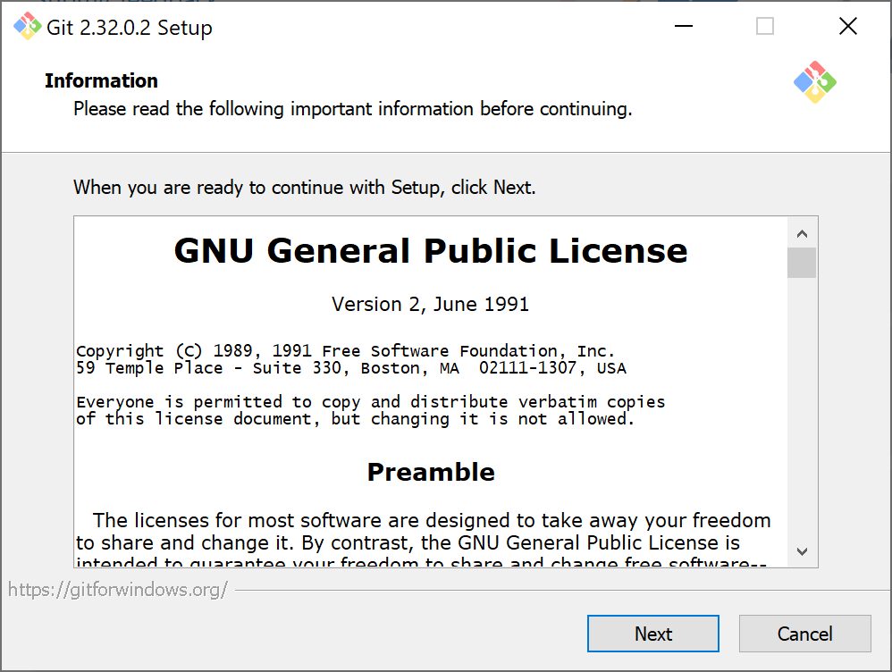
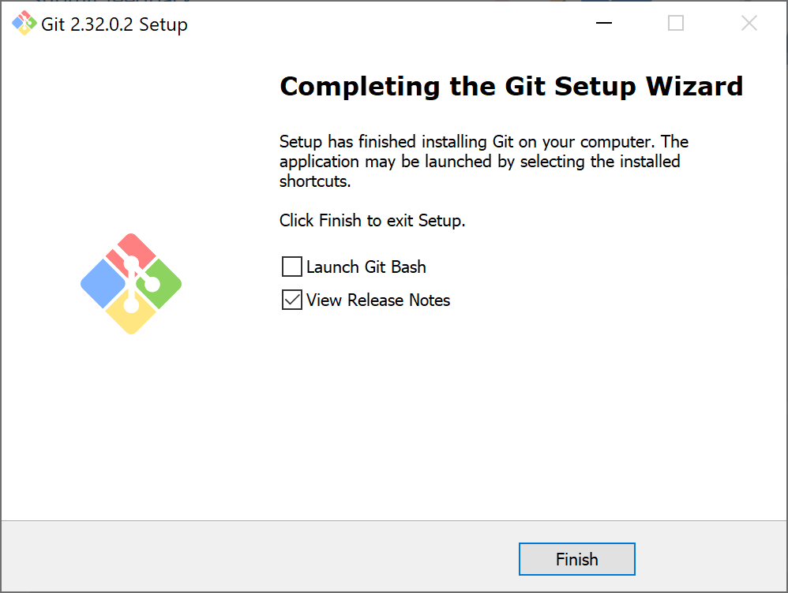
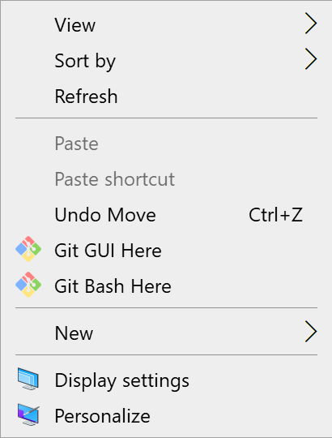
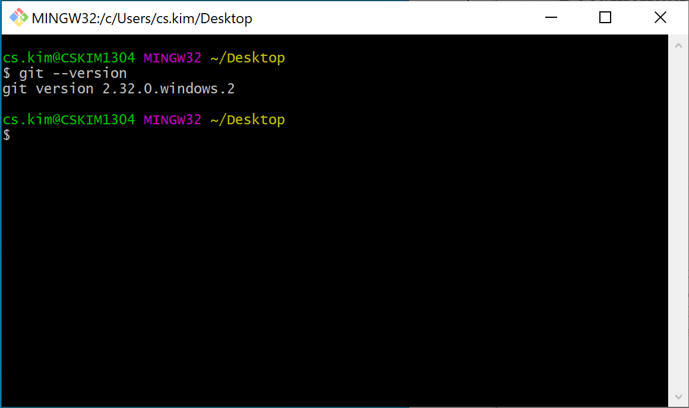

# Git 설치

::: tip ⚡️ 목표
Git 프로그램을 설치하고 기본 환경을 설정합니다.
:::

## macOS

패키지 매니저를 이용하여 git을 설치합니다.

1. [homebrew](https://brew.sh/) 패키지 매니저 설치

```sh
/bin/bash -c "$(curl -fsSL https://raw.githubusercontent.com/Homebrew/install/master/install.sh)"
# update package list
brew update
# check
brew doctor
```

2. Git 설치

```sh
# install
brew install git
# upgrade
brew upgrade git
# check
git --version
```

3. Git 설정

사용자 정보를 설정하고 한글 파일 깨짐 현상을 방지합니다.

```sh
# Your Name을 변경해 주세요
git config --global user.name "Your Name"
# you@your-email.com을 변경해 주세요
git config --global user.email "you@your-email.com"
# 자모 분리 현상 방지
git config --global core.precomposeunicode true
# 한글 출력 오류 방지
git config --global core.quotepath false
```

## Windows

파일을 다운받아 설치합니다.

1. [공식 홈페이지](https://git-scm.com/) 접속


2. `Download for Windows` 버튼 클릭



3. 파일 다운로드 후 설치

<div style="text-align: center; margin-top: 15px">
  
</div>

4. 여러 옵션을 선택하는데, 기본값으로 `Next` 선택 (꽤 많이..)

<div style="text-align: center; margin-top: 15px">
  
</div>

5. 마침내 완료! 🎉

<div style="text-align: center; margin-top: 15px">
  
</div>

6. 바탕화면에서 오른쪽 버튼을 누르고 `Git Bash Here` 선택

<div style="text-align: center; margin-top: 15px">
  
</div>

```sh
# check
git --version
```

7. Git 설정

사용자 정보를 설정하고 한글 파일 깨짐 현상을 방지합니다.

```sh
# Your Name을 변경해 주세요
git config --global user.name "Your Name"
# you@your-email.com을 변경해 주세요
git config --global user.email "you@your-email.com"
# 한글 출력 오류 방지
git config --global core.quotepath false
```
