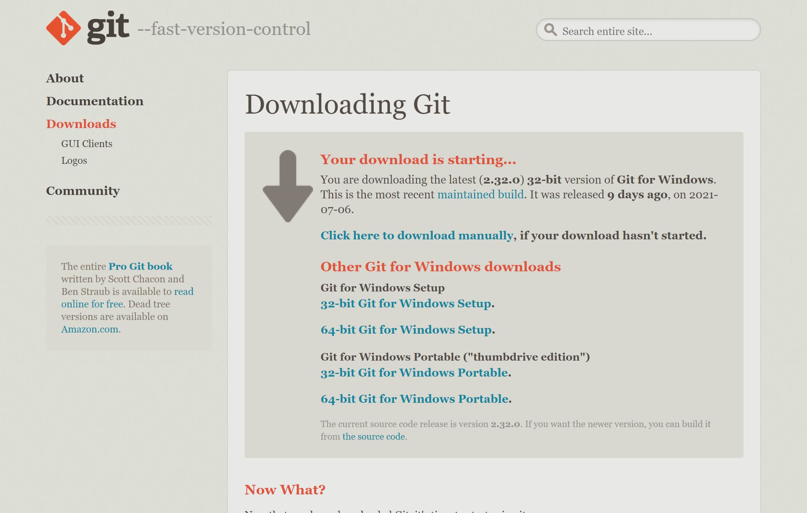

# Git 설치

::: tip ⚡️ 목표
Git 프로그램을 설치하고 기본 환경을 설정합니다.
:::

## macOS

패키지 매니저(brew)를 이용하여 Git을 설치합니다.

1. [homebrew](https://brew.sh/) 패키지 매니저 설치

:::warning M1 mac
애플 실리콘 mac을 사용중이라면, Rosetta(x86_64 가상화)로 터미널을 실행하거나 Homebrew 설치 후 스크립트를 실행해야 합니다.

- [Rosetta 설정하기](https://mysetting.io/apps/mac-arm64) <Badge text="추천" />
- Rosetta 설정없이 사용한다면 Homebrew 설치 후 다음 명령어를 입력

```
echo 'eval "$(/opt/homebrew/bin/brew shellenv)"' >> /Users/<USER_ID>/.zprofile
eval "$(/opt/homebrew/bin/brew shellenv)"
```

:::

```sh
# Homebrew 설치
/bin/bash -c "$(curl -fsSL https://raw.githubusercontent.com/Homebrew/install/master/install.sh)"
# 설치 확인
brew
```

2. Git 설치

```sh
# Git 최초 설치
brew install git
# 이전에 설치했다면, 최신버전으로 업데이트
brew upgrade git
# 설치 확인
git version
```

3. Git 환경 설정

사용자 정보를 설정하고 한글 파일 깨짐 현상을 방지합니다.

```sh
# Your Name을 변경해 주세요
git config --global user.name "Your Name"
# you@your-email.com을 변경해 주세요
git config --global user.email "you@your-email.com"
# 자모 분리 현상 방지
git config --global core.precomposeunicode true
# 한글 출력 오류 방지
git config --global core.quotepath false
```

## Windows

파일을 다운받아 설치합니다.

1. [공식 홈페이지](https://git-scm.com/) 접속


2. `Download for Windows` 버튼 클릭



3. 파일 다운로드 후 설치 프로그램 실행

<div class="image-450 no-radius">


</div>

4. 여러 옵션을 선택하는데, 기본값으로 `Next` 선택 (여러번 물어봄)

<div class="image-450 no-radius">


</div>

5. 설치 완료! 🎉

<div class="image-200 no-radius">


</div>

6. Git 실행을 위해 바탕화면에서 오른쪽 버튼을 누르고 `Git Bash Here` 선택

<div class="image-450 no-radius">


</div>

```sh
# 설치 확인
git version
```

:::tip Git Bash
git은 윈도우에 내장된 `cmd`가 아닌 `Git Bash`에서 실행합니다. 좀 더 이쁜 터미널을 원한다면 [cmder](https://cmder.net/)를 설치해보세요.
:::

7. Git 환경 설정

사용자 정보를 설정하고 한글 파일 깨짐 현상을 방지합니다.

```sh
# Your Name을 변경해 주세요
git config --global user.name "Your Name"
# you@your-email.com을 변경해 주세요
git config --global user.email "you@your-email.com"
# 한글 출력 오류 방지
git config --global core.quotepath false
```
