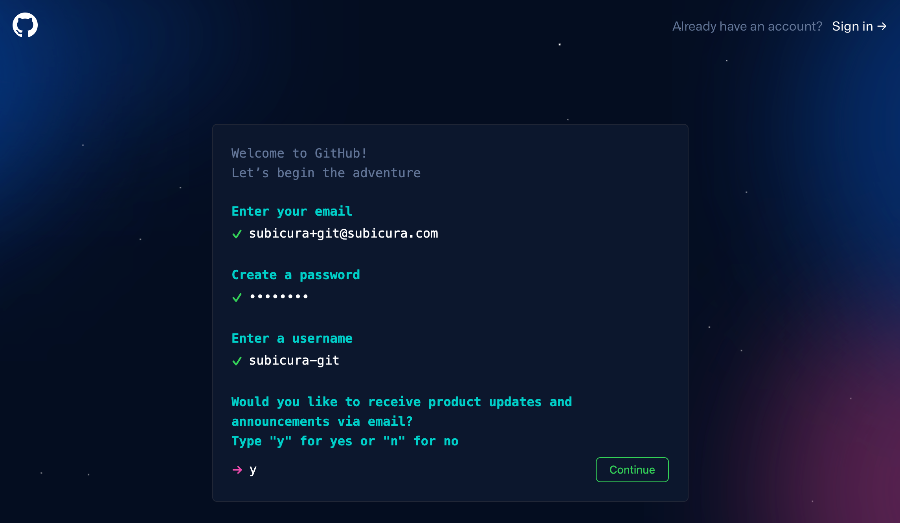
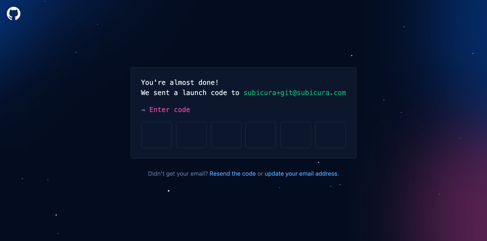

# GitHub 가입

::: tip ⚡️ 목표
GitHub 계정을 생성합니다.
:::

1. [GitHub 홈페이지](https://github.com/) 접속

2. `Sign up` 선택

3. 이메일 주소 + 패스워드 + username 입력
4. 이후에 나오는 로봇 가입 방지용 퍼즐 풀고 `Create account` 선택

5. 이메일로 전달된 코드 6자리 입력 ~~화려한 회원가입 영상 확인~~
