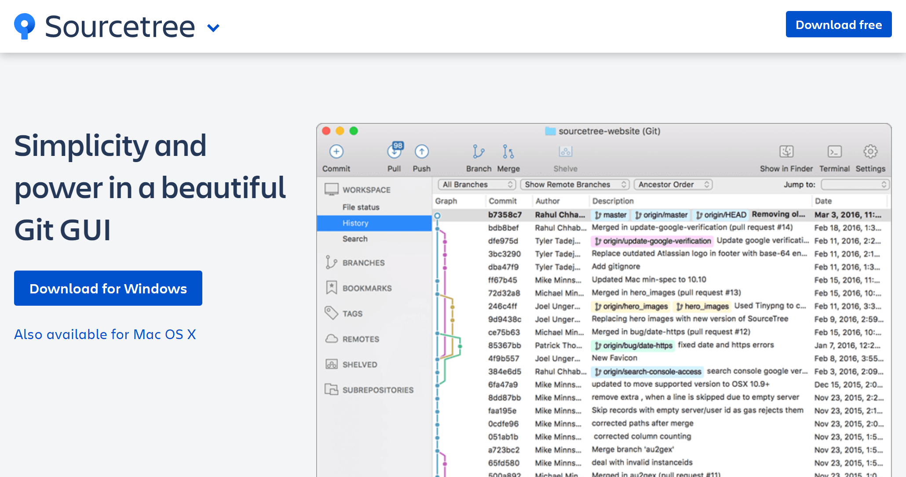
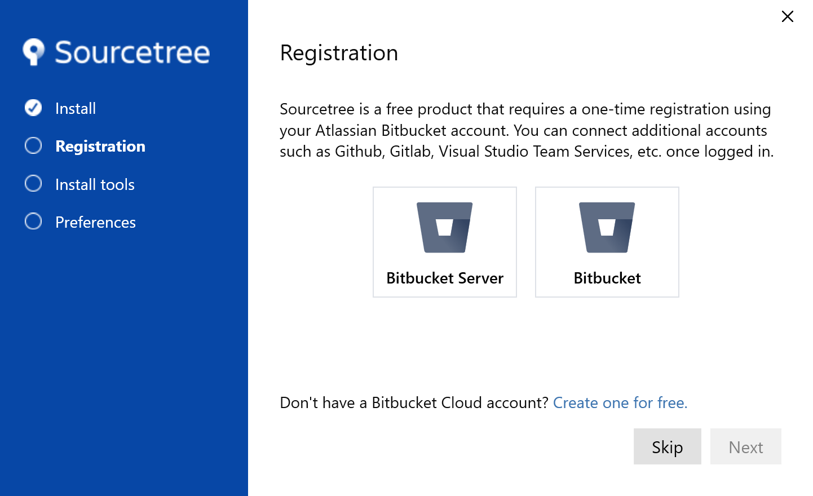
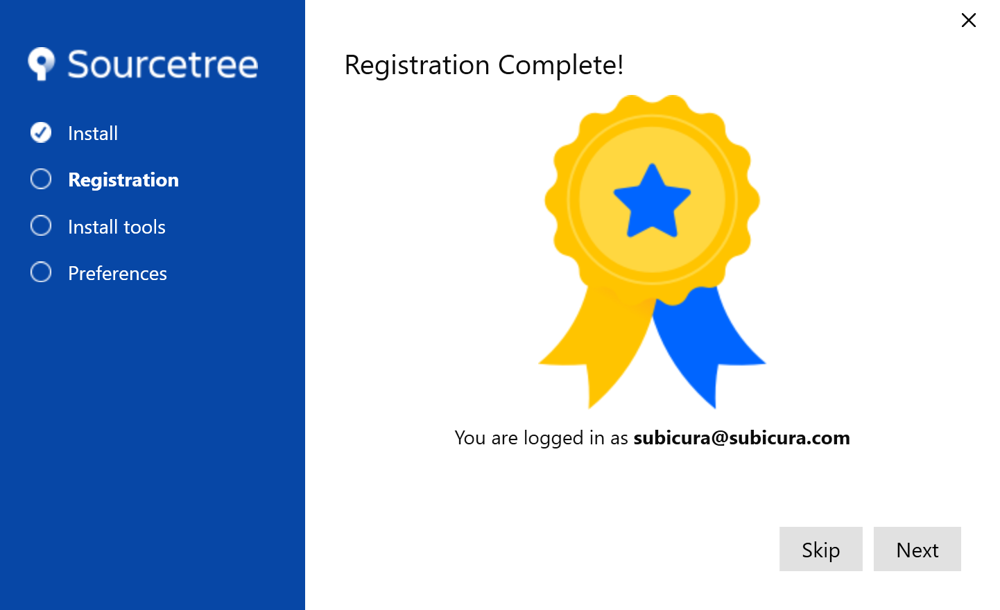
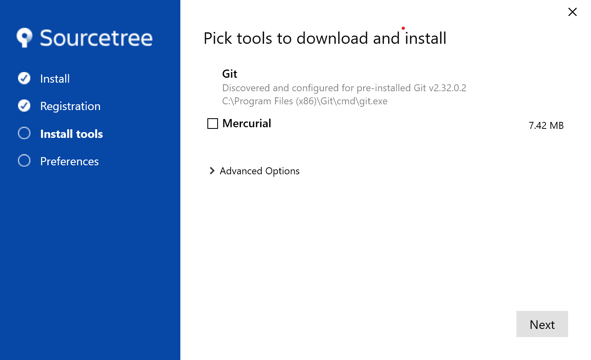
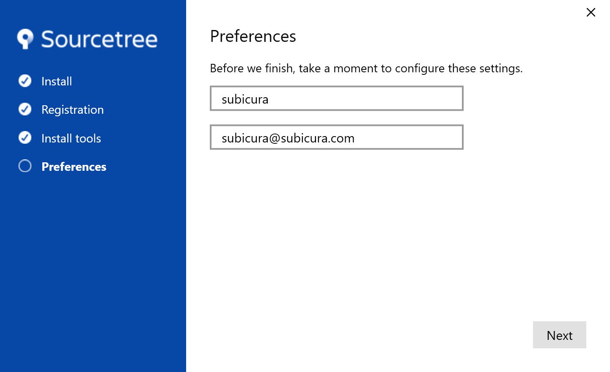

# SourceTree 설치

::: tip ⚡️ 목표
SourceTree를 설치합니다.
:::

버전 관리에 특화된 애플리케이션 중 대표적인 무료 프로그램을 설치합니다.

## macOS

1. [공식 홈페이지](https://www.sourcetreeapp.com/) 접속

2. `Download for Mac OS X` 버튼 선택

  

3. 다운받은 파일을 압축 해제하고 `Sourcetree` 아이콘을 드래그하여 `Applications`로 이동

4. 애플리케이션을 실행하고 `Continue` 선택

5. Git에서 user 정보를 설정했다면 추가 설정없이 `Done` 선택

  

7. 설치 완료! 🎉

## Windows

1. [공식 홈페이지](https://www.sourcetreeapp.com/) 접속

2. `Download for Windows` 버튼 선택

  

3. `Bitbucket` 선택 후 `Next` 버튼 선택 -> 로그인 창 (브라우저)

4. 웹페이지에서 원하는 방식을 선택하여 로그인 후 애플리케이션으로 돌아옴 ~~왜 윈도우만 강제 로그인이지? ㅠㅠ~~

  

5. 로그인 아이디 확인 후 `Next` 선택

  

6. `Mercurial`은 사용하지 않기 때문에 체크 해제 후 `Next` 선택

  

7. 사용자 정보 설정 후 `Next` 선택

  

8. 설치 완료 🎉
