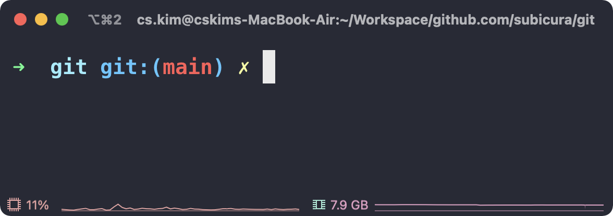

# 터미널 설정

::: tip ⚡️ 목표
밋밋한 쉘 프롬프트에 Git 상태를 추가하고 Git 명령어 별칭<sub>alias</sub>을 설정합니다.
:::

<div class="image-450">


</div>

기존 터미널을 다음과 같이 변경합니다.

<div class="image-450">



</div>

**추가 기능**

- 현재 브랜치 표시
- Git 작업 상태 표시
- [Git 명령어 alias](https://github.com/ohmyzsh/ohmyzsh/blob/master/plugins/git/git.plugin.zsh) 적용
- Git 명령어 + 인자 자동 완성

:::tip 별칭 alias
`git status`를 `gst`와 같이 줄여 쓰는 걸 의미합니다. `g`로 시작하고 외우기 쉽게 되어 있으니 적극적으로 활용해보세요.

| 명령어     | Alias |
| ---------- | ----- |
| git status | gst   |
| git push   | gp    |
| git pull   | gl    |
| git merge  | gm    |
| git add -A | gaa   |
| git commit | gc    |
| ...        | ...   |

:::

## macOS

1. zsh을 최신 버전으로 업데이트하고 [zsh-completions](https://github.com/zsh-users/zsh-completions) 설치

```sh
brew install zsh zsh-completions
```

2. oh-my-zsh 설치

```sh
sh -c "$(curl -fsSL https://raw.githubusercontent.com/ohmyzsh/ohmyzsh/master/tools/install.sh)"
```

> 더 멋지게 터미널을 꾸미고 싶다면 [본격 macOS에 개발 환경 구축하기](https://subicura.com/2017/11/22/mac-os-development-environment-setup.html)를 참고하세요.

## Windows

1. zsh 다운로드

[https://packages.msys2.org/package/zsh?repo=msys&variant=x86_64](https://packages.msys2.org/package/zsh?repo=msys&variant=x86_64)

```sh
# 기본 다운로드 경로
https://mirror.msys2.org/msys/x86_64/zsh-5.8-5-x86_64.pkg.tar.zst

# 32bit인 경우는 다음 경로로
https://mirror.msys2.org/msys/i686/zsh-5.8-5-i686.pkg.tar.zst
```

> `.zst` 확장자 압축을 풀기 위해 [Bandizip](http://www.bandisoft.com/bandizip/)을 설치합니다.

2. `C:\Program Files\Git`에 압축 풀기

반디집으로 `zsh-5.8-5-x86_64.pkg.tar.zst`를 압축해제 하면 `zsh-5.8-5-x86_64.pkg.tar` 파일이 생깁니다. 그럼 한 번 더 압축을 해제합니다.

<div class="image-600 no-radius">


</div>

`Extract to "Archive-Name" folder under the selected folder` 옵션을 해제하고 Git 디렉토리를 선택한 다음, 압축을 해제합니다.

3. zsh 설정 및 oh-my-zsh 설치

```sh
# bash > zsh 변경
zsh
# install oh-my-zsh
sh -c "$(curl -fsSL https://raw.githubusercontent.com/robbyrussell/oh-my-zsh/master/tools/install.sh)"
```

:::warning bash: zsh: command not found
오류 메시지가 뜬다면 zsh 압축이 Git 디렉토리에 정확히 풀렸는지 확인해주세요.
:::

:::warning Error: this script is obsolete, please see git-completion.zsh
oh-my-zsh 설치 후 뜨는 에러는 무시해주세요.
:::

매번 `git bash`를 실행하고 `zsh`입력이 불편하다면 다음과 같은 `C:\Users\{id}\.bashrc` 파일을 생성합니다. 강제로 `zsh`로 전환합니다.

```sh
# Launch Zsh
if [ -t 1 ]; then
exec zsh
fi
```
