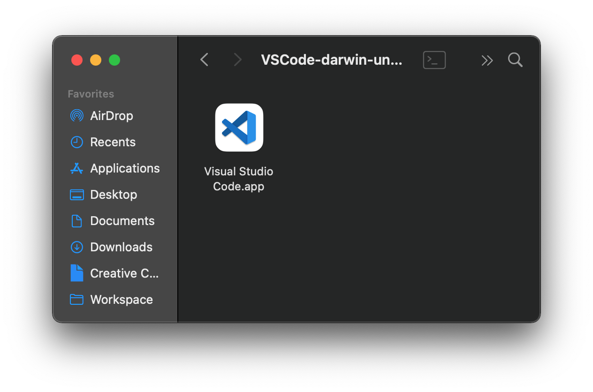
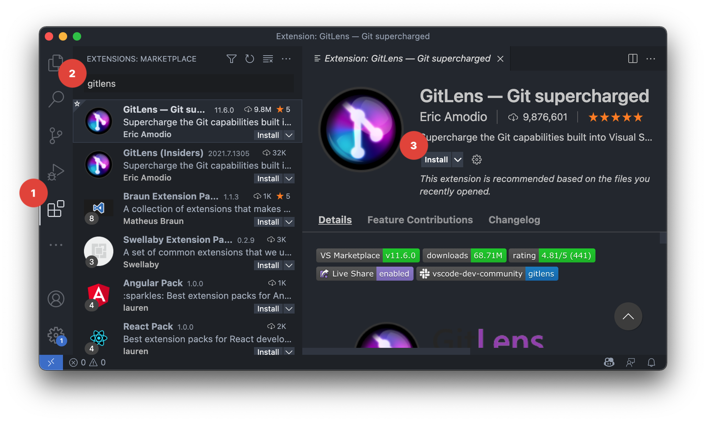
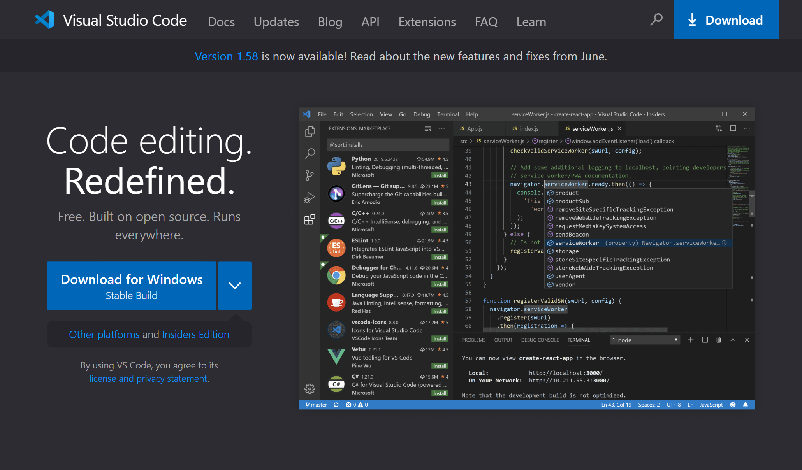
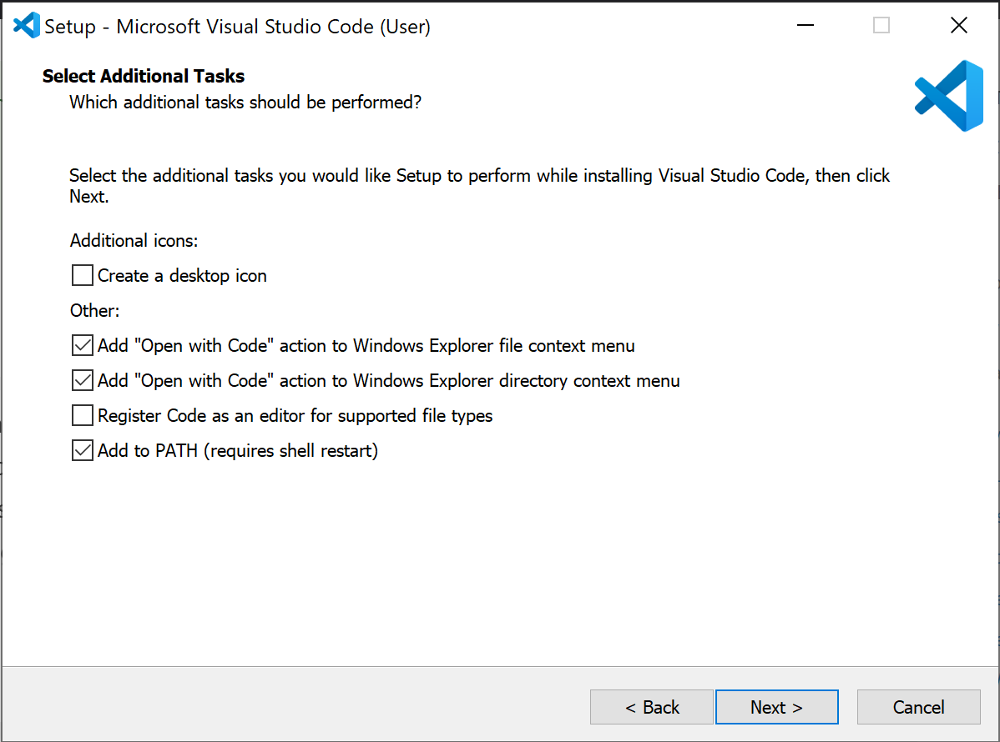

# VSCode 설치

::: tip ⚡️ 목표
Visual Studio Code를 설치하고 Git과 관련된 플러그인을 추가합니다.
:::

터미널을 열지 않고 에디터에서 Git 명령어를 사용할 수 있다면, 더 효율적인 개발이 가능합니다.

## macOS

1. [공식 홈페이지](https://code.visualstudio.com/) 접속

2. `Download Mac Universal` 버튼 선택

  

3. 다운받은 파일을 압축 해제하고 `Visual Studio Code` 아이콘을 드래그하여 `Applications`로 이동

4. VSCode를 실행하고 다음 플러그인 설치
   - [GitLens — Git supercharged](https://marketplace.visualstudio.com/items?itemName=eamodio.gitlens)
   - [Git History](https://marketplace.visualstudio.com/items?itemName=donjayamanne.githistory)

## Windows

1. [공식 홈페이지](https://code.visualstudio.com/) 접속

2. `Download for Windows` 버튼 선택

  

3. 설치 중간에 `Add "Open with Code" action to Windows Explorer file context menu`와 `Add "Open with Code" action to Windows Explorer directory context menu`를 선택하여 오른쪽 버튼으로 vscode 실행할 수 있도록 설정

4. VSCode를 실행하고 다음 플러그인 설치
   - [GitLens — Git supercharged](https://marketplace.visualstudio.com/items?itemName=eamodio.gitlens)
   - [Git History](https://marketplace.visualstudio.com/items?itemName=donjayamanne.githistory)
