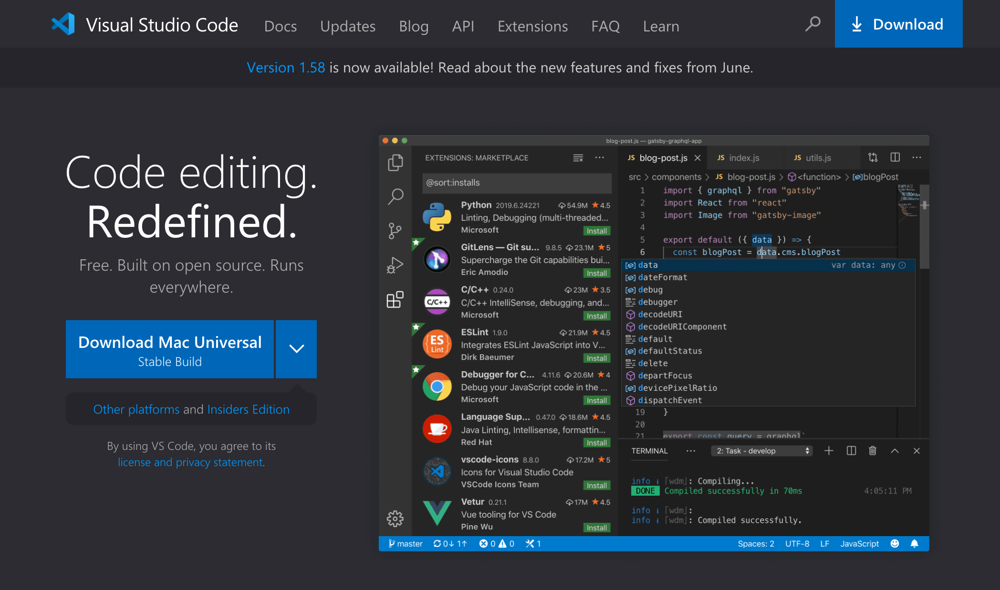

# VSCode 설치

::: tip ⚡️ 목표
Visual Studio Code를 설치하고 Git과 관련된 플러그인을 추가합니다.
:::

Visual Studio Code의 주기능은 코드 작성이지만, 버전 관리를 위한 기능이 기본으로 포함되어 있고 각종 플러그인을 추가하여 풍부한 기능을 사용할 수 있습니다.

에디터에 내장된 버전 관리 기능을 익힌다면, 에디터 - 터미널 - 에디터 - 터미널을 왔다 갔다 하지 않고 더 효율적으로 작업할 수 있습니다. 여기서는 가장 널리 사용되는 Visual Studio Code를 설명하지만, IntelliJ나 다른 도구들도 버전 관리 할 수 있는 방법을 비슷한 철학으로 제공하기 때문에 꼭 찾아보시기 바랍니다.

터미널을 열지 않고 에디터에서 Git 명령어를 사용할 수 있다면, 더 효율적인 개발이 가능합니다.

## macOS

1. [공식 홈페이지](https://code.visualstudio.com/) 접속

2. `Download Mac Universal` 버튼 선택

  

3. 다운받은 파일을 압축 해제하고 `Visual Studio Code` 아이콘을 드래그하여 `Applications`로 이동

4. VSCode를 실행하고 다음 플러그인 설치
   - [GitLens — Git supercharged](https://marketplace.visualstudio.com/items?itemName=eamodio.gitlens)
   - [Git History](https://marketplace.visualstudio.com/items?itemName=donjayamanne.githistory)

## Windows

1. [공식 홈페이지](https://code.visualstudio.com/) 접속

2. `Download for Windows` 버튼 선택

  

3. 설치 중간에 `Add "Open with Code" action to Windows Explorer file context menu`와 `Add "Open with Code" action to Windows Explorer directory context menu`를 선택하여 오른쪽 버튼으로 vscode 실행할 수 있도록 설정

4. VSCode를 실행하고 다음 플러그인 설치
   - [GitLens — Git supercharged](https://marketplace.visualstudio.com/items?itemName=eamodio.gitlens)
   - [Git History](https://marketplace.visualstudio.com/items?itemName=donjayamanne.githistory)
